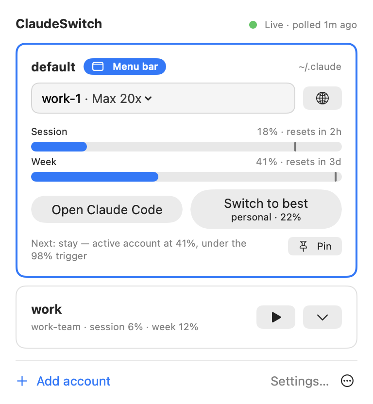
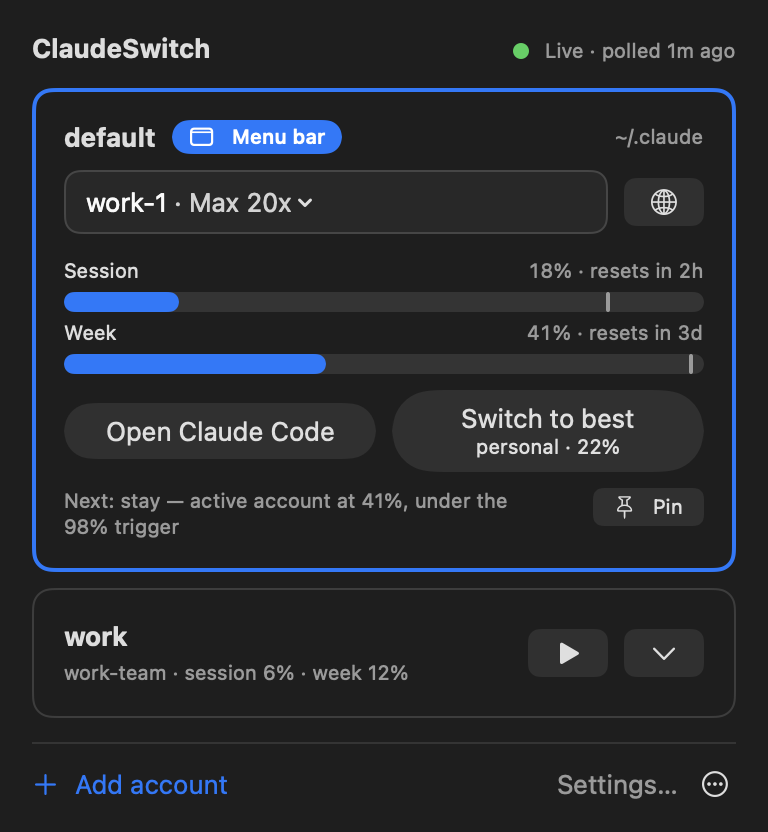
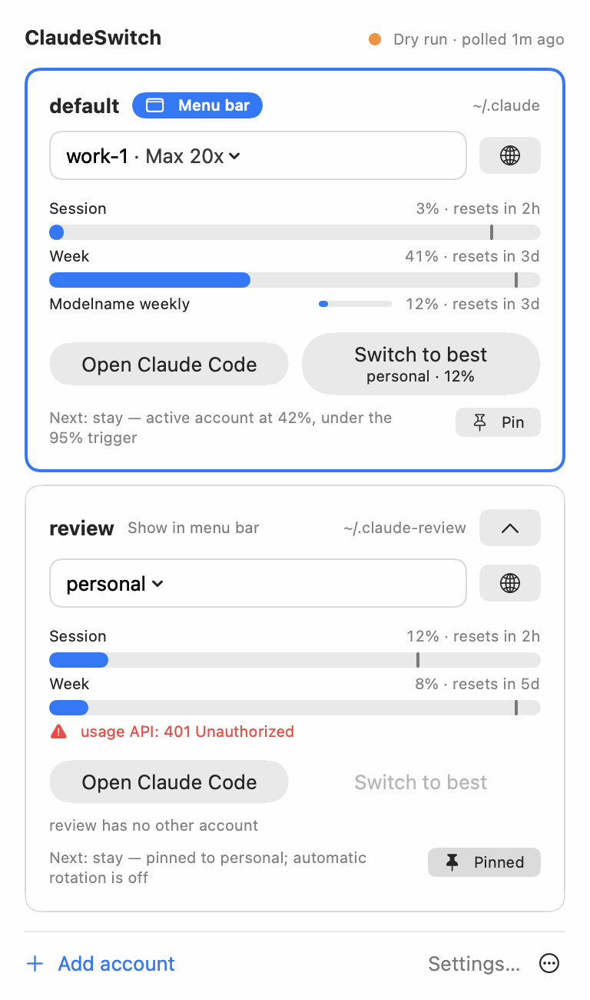
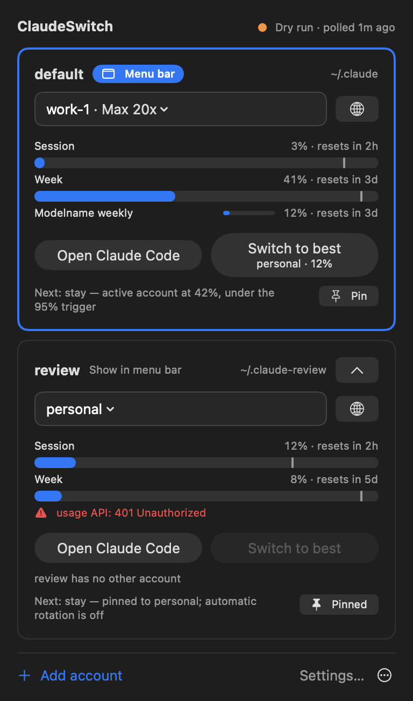

# claudeswitch

Keeps Claude Code on an account that still has quota.

claudeswitch watches every Claude account you have, shows where each one
stands, and hot-swaps Claude Code onto a fresh account before the current one
hits its limit: no restart, no lost session. It ships as a Go CLI plus daemon
(macOS and Linux), a native macOS menu-bar app and a Claude Code plugin.

Latest release: **v0.5.2**
([releases](https://github.com/bogdan-alexandrescu/claudeswitch/releases)).

<p align="center"></p>

[`docs/GUIDE.md`](docs/GUIDE.md) is the full manual. This README covers
installing it and finding your way around.

## Contents

- [Features](#features)
- [How it works](#how-it-works)
- [Install](#install)
  - [Binary](#binary)
  - [Daemon](#daemon)
  - [Menu-bar app (macOS)](#menu-bar-app-macos)
  - [Claude Code plugin](#claude-code-plugin)
- [Quick start](#quick-start)
- [The macOS app](#the-macos-app)
- [The cs CLI](#the-cs-cli)
- [Inside Claude Code](#inside-claude-code)
- [Configuration](#configuration)
- [Claude in Chrome](#claude-in-chrome)
- [Troubleshooting](#troubleshooting)
- [Uninstall](#uninstall)
- [Safety](#safety)
- [License](#license)

## Features

- **Every account at a glance.** Session (5-hour) and weekly utilization, reset
  times, per-model weekly limits, and which account each Claude Code profile is
  on.
- **Rotation before the wall.** The daemon moves a profile to another account
  at 85% of the session window or 98% of the weekly one, between turns where it
  can. Past 99% it swaps mid-turn.
- **Hot swaps.** Only the live credential changes. Running sessions pick it up
  from their next request. Your MCP logins are left alone.
- **Several Claude Code profiles.** Each config directory (`~/.claude`,
  `~/.claude-work`, ...) has its own pool of accounts, and one daemon drives
  them all.
- **Credentials kept alive.** Stored credentials are renewed before they
  expire, and dead refresh tokens are found within a day rather than when you
  need the account ([→ how](docs/GUIDE.md#keeping-credentials-alive)).
- **Explanations.** `cs why` says, account by account, why it is staying,
  switching or waiting. `cs audit` shows what it observed, decided and did.
- **Usage across a session.** `cs session` adds up tokens across every account
  a stretch of work touched.
- **A menu-bar app, a status line and a plugin**, all reading the same state.

## How it works

```
                  usage API (/api/oauth/usage)
                        ^            ^
                        |  polls     |  polls
                  +-----+------------+------+
                  |   claudeswitch daemon    |
                  |   decides per profile,   |
                  |   swaps the live         |
                  |   credential             |
                  +-----+------------+-------+
                        |            |
        swap live cred  |            |  swap live cred
                        v            v
         profile "default"          profile "work"
         ~/.claude                  ~/.claude-work
         pool: personal, research   pool: work-1, work-team
                        |            |
                   Claude Code   Claude Code
```

Each account's credential is stored in a vault: the macOS Keychain, or `0600`
files on Linux. The daemon polls each account's usage within a strict call
budget and records the readings in `~/.local/state/claudeswitch/state.json`.
When the account a profile is using crosses its trigger, the daemon picks the
next eligible account from that profile's pool and writes its credential into
the profile's live slot. Claude Code reads the new credential on its next
request.

Everything else reads that state file: `cs status`, the status line, the
session-start hook and the menu-bar app. None of them spend API calls or touch
the keychain to show you a figure.

## Install

There are four parts. The binary is required. The others are optional, and
each needs the binary.

| part | gives you | needs |
|---|---|---|
| binary | `claudeswitch`, and `cs` as a symlink to it | a release archive, or Go to build it |
| daemon | automatic rotation, credential renewal, notifications | the binary; launchd (macOS) or systemd `--user` (Linux) |
| menu-bar app | every profile and account in the menu bar, switching, settings | macOS 13 or later, binary 0.5.1 or later |
| Claude Code plugin | quota context in every session, `/cs` commands | the binary, Claude Code |

`cs` is a symlink, not a shell alias, on purpose: aliases do not exist in
non-interactive shells, scripts or Claude Code's `!` prefix.

### Binary

From a release. Each release has archives for macOS and Linux on amd64 and
arm64, and a `checksums.txt`. The archives are reproducible: the same tag
always produces the same bytes.

```sh
VERSION=v0.5.2
TARGET=darwin_arm64            # darwin_amd64, linux_amd64, linux_arm64
BASE=https://github.com/bogdan-alexandrescu/claudeswitch/releases/download/$VERSION
curl -LO "$BASE/claudeswitch_${VERSION}_${TARGET}.tar.gz"
curl -LO "$BASE/checksums.txt"
shasum -a 256 -c checksums.txt --ignore-missing   # Linux: sha256sum -c --ignore-missing checksums.txt
tar -xzf "claudeswitch_${VERSION}_${TARGET}.tar.gz"
mkdir -p ~/.local/bin
install -m 0755 claudeswitch ~/.local/bin/claudeswitch
ln -sf claudeswitch ~/.local/bin/cs
```

The archive holds the binary, `LICENSE` and this README.

From source, with Go 1.23 or later:

```sh
git clone https://github.com/bogdan-alexandrescu/claudeswitch
cd claudeswitch
./install.sh
```

`install.sh` builds the binary, installs it to `~/.local/bin`, adds the `cs`
symlink, and installs the daemon in dry-run (see [Daemon](#daemon)). To build
the binary alone: `go build -o bin/claudeswitch ./cmd/claudeswitch`.

**Verify it worked:** `cs version` prints `claudeswitch v0.5.2`. If the shell
cannot find `cs`, add `~/.local/bin` to your `PATH`.

### Daemon

The daemon does the polling, the rotation and the credential renewal. It is
installed in **dry-run** by default: it makes every decision and logs the swap
it would make, but changes nothing. Run it that way for a day, check
`cs audit --kind decision`, then make it live.

From a source checkout:

```sh
./install.sh            # build, install, load the service in dry-run
./install.sh --live     # ...or in live mode
```

With a release binary, from `~/.local/bin`:

```sh
claudeswitch daemon install            # dry-run
claudeswitch daemon install --live     # live
```

Either way it runs as a launchd agent on macOS (`xyz.claudeswitch.daemon`) or
a systemd `--user` unit on Linux (`claudeswitch.service`). Once it is
installed, switch modes and manage it without reinstalling:

```sh
cs daemon live          # start acting
cs daemon dry-run       # back to reporting only
cs daemon status|start|stop|restart
```

Re-running `./install.sh` without `--live` puts a live daemon back into
dry-run.

On macOS a newly built binary is a stranger to the Keychain, and a daemon
cannot answer the access prompt. `install.sh` triggers that prompt while you
are at the keyboard. With a release binary, run `cs whoami` once before
`daemon install` and click **Always Allow**.

The log is `~/.local/state/claudeswitch/daemon.log` (on Linux also
`journalctl --user -u claudeswitch`). More in
[docs/GUIDE.md → Running as a daemon](docs/GUIDE.md#running-as-a-daemon).

**Verify it worked:** `cs doctor`'s daemon row reads "running, not older than
this binary", and `cs status` ends with "a daemon is polling; these are its
readings".

### Menu-bar app (macOS)

Building it on your Mac is the recommended way. It needs only the Command Line
Tools (`xcode-select --install`), not Xcode and not an Apple Developer
account. A copy built locally was never downloaded, so it opens without a
Gatekeeper warning.

```sh
./install-app.sh               # build, install in /Applications, offer to open it
./install-app.sh --uninstall   # quit it and remove it
```

It goes to `/Applications`, or `~/Applications` if that is not writable.
Re-run it after pulling to update.

From a release, as a universal build:

```sh
VERSION=v0.5.2
BASE=https://github.com/bogdan-alexandrescu/claudeswitch/releases/download/$VERSION
ZIP="ClaudeSwitch-${VERSION#v}-macos.zip"
curl -LO "$BASE/$ZIP"
curl -LO "$BASE/$ZIP.sha256"
shasum -a 256 -c "$ZIP.sha256"
ditto -x -k "$ZIP" .
mv ClaudeSwitch.app /Applications/
```

The release app is **not** signed with a Developer ID or notarized, so macOS
blocks its first launch. Either open it once, click **Done**, then go to
**System Settings > Privacy & Security** and click **Open Anyway**, or remove
the quarantine flag yourself:

```sh
xattr -dr com.apple.quarantine /Applications/ClaudeSwitch.app
```

The app needs the `claudeswitch` binary, version 0.5.1 or later. It looks in
the path set in Settings > Advanced, then `~/.local/bin`, then `PATH` and the
usual Homebrew and Go locations. Without one, its menu says so and shows how
to install it. [macos/README.md](macos/README.md) has the details.

**Verify it worked:** a gauge icon with the live account and its utilization
appears in the menu bar. If you see nothing on a MacBook with a notch, see
[Troubleshooting](#troubleshooting).

### Claude Code plugin

Install the binary first. Then, inside Claude Code:

```
/plugin marketplace add https://github.com/bogdan-alexandrescu/claudeswitch
/plugin install cs@claudeswitch
```

or from a shell:

```sh
claude plugin marketplace add https://github.com/bogdan-alexandrescu/claudeswitch
claude plugin install cs@claudeswitch
```

Start a new session, then run `/cs setup`. It checks that the binary is
reachable, adds the status line to Claude Code's settings, and runs
`cs doctor`. The plugin's version always matches the binary release it shipped
with. To update it:

```sh
claude plugin marketplace update claudeswitch
claude plugin update cs@claudeswitch
```

<details>
<summary>Migrating from v0.4.0 (<code>claudeswitch@claudeswitch</code>)</summary>

v0.4.0 shipped the plugin as `claudeswitch@claudeswitch`, with skills under
`/claudeswitch:`. From v0.4.1 it is `cs`, with one `/cs` command. Reinstall:

```sh
claude plugin uninstall claudeswitch@claudeswitch
claude plugin marketplace update claudeswitch
claude plugin install cs@claudeswitch
```

</details>

**Verify it worked:** a new session starts with two `[claudeswitch]` context
lines, and `/cs status` prints the status table. `cs doctor` shows
`[ok  ] claude plugin   installed`.

## Quick start

```sh
cs setup
```

`setup` is interactive and does the whole first run. It finds the account you
are signed in to now, walks you through signing in to each additional one,
writes a config with each account pinned to its seat, and offers to install
the daemon in dry-run and to add the status line.

To add more accounts later:

```sh
cs login work-1 --direct                    # sign in through a browser; your live session is untouched
cs login work-1 --direct --browser Safari   # ...in a browser that is signed in to that account
cs add research                             # or: /login in Claude Code, then save that login as "research"
```

A login returns a credential for whichever account your browser is signed in
to. Separate browser applications keep separate cookies, which is what
`--browser` is for. `login` and `add` verify the seat that came back and
refuse a mismatch.

To run a second Claude Code profile with its own pool:

```sh
cs profile create work --pool work-1,work-team --seed work-1
cs run work                                                     # claude, with CLAUDE_CONFIG_DIR set for "work"
```

Then check on it, and make it act when you trust its decisions:

```sh
cs status        # every profile and account
cs why           # what rotation will do, and why
cs daemon live   # let the daemon swap
```

## The macOS app

The menu-bar app shows what claudeswitch knows and lets you manage all of it:
profiles, accounts, settings and the daemon. It is a native SwiftUI app.

It only reads `~/.local/state/claudeswitch/state.json` and runs
`claudeswitch ... --json` commands from [docs/APP_CLI.md](docs/APP_CLI.md). It
never reads the keychain and never calls the usage API itself. It re-reads the
state file on every save, and runs `cs why --json` every 20 seconds and after
each action.

### Menu-bar label

<p align="center"></p>

The label shows the live account of the profile you follow and its binding
utilization, for example `default · work-1 41%` (no profile name when you have
only one). The gauge moves as that window nears its switch threshold, and
turns into a warning triangle with a trailing `!` once it is over it or the
account needs a login. `cs ...` means it is still loading. A question mark
means the `claudeswitch` binary is missing or too old. Icon-only is a setting
(Advanced).

### Popover

<table>
  <tr>
    <td align="center"></td>
    <td align="center"></td>
  </tr>
</table>

At the top is the daemon: live or dry run, how long since it polled, and "not
polling for N m" if it has stopped. Below it is a card per profile. The
followed profile's card is open and shows:

- its directory;
- the live account, as a picker of the profile's pool;
- session and weekly bars with a tick at the profile's own threshold;
- resets and per-model weekly limits;
- what rotation will do next, and why.

The card's buttons are **Open Claude Code** (your terminal running
`cs run <profile>`: Terminal, iTerm, Ghostty or Warp), **Switch to best**
(which names the account it would move to and its utilization), the globe that
opens the account's Chrome profile, and **Pin**. The other profiles are compact
rows with a play button for Claude Code and a chevron that expands them.
**+ Add account** and **Settings...** are at the foot.

### Warnings

<table>
  <tr>
    <td align="center"></td>
    <td align="center"></td>
  </tr>
</table>

Problems appear where they apply. Here the daemon is in dry run, so nothing
rotates by itself. In the `review` profile, the usage API answers its account
with a 401, the account is pinned, and the pool has no other account to move
to, so nothing can rotate there until you sign in to it again
(`cs login <id> --direct`) or add another account to the pool.

### Settings

<table>
  <tr>
    <td width="440"></td>
    <td><b>Profiles.</b> Create a profile with a directory, a pool and a seed
    account. Add, remove and move accounts between pools. Set the five
    per-profile overrides (<code>switch_at</code>, <code>switch_at_weekly</code>,
    <code>hard_floor</code>, <code>landing_margin</code>, <code>models</code>).
    Forget a removed profile's old credential.</td>
  </tr>
  <tr>
    <td width="440"></td>
    <td><b>Accounts.</b> Drag accounts to set the rotation order. Rename an
    account, sign in to it again, open its Chrome profile, or delete it after
    a confirmation that names the account and seat. Recovery copies (logins a
    swap kept aside) are listed here to restore or clear.</td>
  </tr>
  <tr>
    <td width="440"></td>
    <td><b>Rotation, Polling, Advanced, Daemon.</b> Every <code>cs config</code>
    setting, generated from <code>cs config schema --json</code>, with inline
    validation and the CLI's own error messages. The Daemon pane shows its
    status and switches between live and dry run, restarts, starts, stops,
    installs and uninstalls it, and sets the app to launch at login.</td>
  </tr>
</table>

### Add account

<p align="center"></p>

Two ways to add an account:

- **Sign in with a browser.** The app opens the sign-in page in the browser
  you pick, and you paste the code back. Your live session is not touched
  (`cs login <id> --direct --no-open`).
- **Save the login that is live now.** After `/login` in Claude Code, save
  that credential under the name it suggests (`cs add`).

## The cs CLI

`claudeswitch` and `cs` are the same program. Commands that act on one profile
(`use`, `add`, `login`, `whoami`) take `--profile NAME`, and otherwise act on
the profile your shell's `CLAUDE_CONFIG_DIR` belongs to. `status`, `why`,
`plan` and `top` show every profile unless you pass `--profile`.

Most commands take `--json`. Those the menu-bar app runs never prompt and fail
with a stable `{"error": {"code", "message", "hint"}}` object.
[docs/APP_CLI.md](docs/APP_CLI.md) is that contract, and `cs version --json`
names its version.

The screenshots below use made-up accounts (`work-1`, `work-team`,
`personal`, `research`) in two profiles, `default` and `work`.

### cs

With no command, `cs` lists every command.

<p align="center"></p>

### cs status

Every profile, its pool and the utilization of each account in both windows.
`▸` marks the live account. `--detail` adds reading age, burn rate and the
binding limit. `cs top` is the same view, redrawn in place.

<p align="center"></p>

### cs why

The rotation decision for each profile, with every account considered in
order and the reason it is or is not eligible. It reads saved state only and
makes no API calls.

<p align="center"></p>

### cs doctor

Checks everything that has to be true for rotation to work: the config, the
vault, the daemon, the live credential, the usage API, each profile, the
refresh policy, the polling budget, the status line and the plugin.
`--verify` also confirms every stored credential still authenticates (one API
call each).

<p align="center"></p>

### cs use

Swaps a profile onto another account straight away. Hot: no restart. Running
sessions pick it up from their next request. `--dry-run` says what it would
do.

<p align="center"></p>

### cs profile list

Each Claude Code profile: its directory, its pool and the account live in it.

<p align="center"></p>

### cs session

Token usage for a stretch of work, split across every account it touched.
It joins Claude Code's transcripts with the audit log's switches, so each
message is counted against the account that was live when it was written. No
API calls. `--since 3h` sets the span and `--detail` adds a per-model
breakdown.

<p align="center"></p>

### Command reference

Every command also takes `--config PATH` to use another config file. Each
command in more depth: [docs/GUIDE.md → Commands](docs/GUIDE.md#commands).

**Looking**

| command | what it does |
|---|---|
| `cs status [--detail] [--profile P] [--json]` | every account's utilization in both windows; `--refresh=false` skips the live read of the account in use, `--max-age D` re-reads anything older |
| `cs top [--every 2s] [--profile P]` | `status`, redrawn in place (ctrl-c to leave) |
| `cs why [--profile P] [--json]` | the rotation decision per profile, account by account, with reasons |
| `cs plan [--profile P] [--json]` | the same decision in brief, and whether anything will act on it |
| `cs whoami [--profile P]` | which account is live in a profile right now |
| `cs accounts [--json]` | what is in the vault: account, email, plan, organization |
| `cs session [--since D] [--detail] [--json]` | token usage across every account used in a span |
| `cs history [--days 21]` | deduplicated rejection history from the transcripts |
| `cs audit [--kind K] [--since D] [--n 30]` | what the daemon observed, decided and did; `K` is `decision`, `switch`, `rejection`, `severity` or `error` |
| `cs doctor [--verify]` | check everything; exits non-zero if a check fails |
| `cs version [--json]` | the version, and with `--json` the app contract version |

**Switching and signing in**

| command | what it does |
|---|---|
| `cs use <id> [--profile P] [--dry-run] [--json]` | swap a profile onto a vaulted account (hot, no restart) |
| `cs login <id> --direct [--browser APP] [--no-open]` | sign in through a browser, verify the seat, vault it and add it to the config, without touching the live session |
| `cs login <id> --code CODE` | finish a `--direct` login with the code the browser shows |
| `cs login <id> [--sso] [--email ADDR] [--prompt select_account\|login] [--keep]` | other sign-in options; without `--direct` it signs in through Claude Code and puts your previous account back unless `--keep` |
| `cs add [<id>] [--from P] [--profile P] [--force] [--json]` | vault the credential that is live now (after `/login`) and add it to the config |
| `cs refresh <id> [--allow-active]` | renew a vaulted credential; never the live one unless you insist |
| `cs run <profile> [-- claude args]` | start Claude Code in a profile |

**Accounts**

| command | what it does |
|---|---|
| `cs priority <id>... [--json]` | set the rotation order (also `cs account priority`) |
| `cs account list [--json]` | accounts with email and plan |
| `cs account pin <id>` / `cs account unpin [<id>] [--profile P]` | stop and resume automatic rotation in that account's profile |
| `cs rename <old> <new>` | re-file an account under another id, in config, state and vault (also `cs account rename`) |
| `cs remove <id> [--yes] [--json]` | delete an account everywhere: credential, config block, pool and priority entries, observations (also `cs account delete`) |
| `cs forget <id>` / `cs forget --stale` | drop an account's recorded observations (not its credential), or those of every account no longer in the config |
| `cs identify [--force]` | record which seat (and email) each vaulted credential belongs to |
| `cs recovery [--identify] [--json]` | list the logins a swap kept aside |
| `cs recovery restore <slot> <account> [--force]` | vault a recovery copy under an account, after checking its seat |
| `cs recovery clear <slot> [--yes]` | delete a recovery copy |

**Profiles**

| command | what it does |
|---|---|
| `cs profile create <name> [--dir PATH] [--pool a,b] [--seed <id>] [--json]` | make a Claude Code profile: its directory, shared settings and skills linked from `~/.claude`, MCP servers copied, its `[[profile]]` block; `--seed` signs it in |
| `cs profile seed <name> <id>` | sign a profile with no credential in with a vaulted account |
| `cs profile list [--json]` | each profile's directory, pool and live account |
| `cs profile pool <name> add\|remove <id> [--to P]` | change a pool (pools never overlap) |
| `cs profile set <name> <key> <value\|inherit>` | per-profile `switch_at`, `switch_at_weekly`, `hard_floor`, `landing_margin` or `models` |
| `cs profile remove <name> [--to P] [--yes]` | remove a profile; its accounts join `--to`, or `default` |
| `cs profile forget <name>` | release the guard on a removed or re-pointed profile's old credential |

**Settings and service**

| command | what it does |
|---|---|
| `cs setup` | guided first run |
| `cs init` | write a starter config to fill in by hand |
| `cs config [--json]` | every setting in force |
| `cs config <name> <value>` / `cs config get\|set ...` | read or change one setting, with validation (`get --profile P` gives a profile's value) |
| `cs config schema [--json]` | every setting's type, range and default |
| `cs config clean [--yes]` | remove the `scope` lines and `[project]` tables older configs carry |
| `cs daemon status\|start\|stop\|restart\|live\|dry-run` | manage the installed service |
| `cs daemon install [--live\|--dry-run]` / `cs daemon uninstall` | register or remove the service for this binary |
| `cs watch [--live] [--quiet] [--idle-gap 8s] [-v]` | run the daemon in the foreground |
| `cs uninstall [--credentials] [--yes]` | stop the daemon and remove what claudeswitch installed |

**Claude Code and Chrome**

| command | what it does |
|---|---|
| `cs statusline` | one line for Claude Code's status line (read-only) |
| `cs statusline install [--force]` / `cs statusline uninstall` | add it to or remove it from `~/.claude/settings.json` |
| `cs context` | the quota summary the plugin gives each session (read-only) |
| `cs chrome add <id>` | create a Chrome profile for an account, for Claude in Chrome |
| `cs chrome [<id>]` | open an account's Chrome profile (no id: the account live in this shell's profile) |
| `cs chrome list [--json]` / `cs chrome forget <id>` | which account has which Chrome profile; drop a mapping |

## Inside Claude Code

With the [plugin](#claude-code-plugin) installed, every session starts knowing
where quota stands. A SessionStart hook runs `cs context`, which reads saved
state only (no keychain, no API calls) and never fails a session start:

```
[claudeswitch] active personal · session 24% (resets 3h47m) · week 44% (resets 4d15h)
[claudeswitch] rotates at session 85% / week 98%, mid-turn at 99% · daemon running, rotates automatically
```

Two lines is the normal case; more mean something needs attention
([→ details](docs/GUIDE.md#every-session-starts-knowing-where-quota-stands)).

`/cs` works like `cs` in a terminal. With no command it shows status. You can
also just ask, and Claude runs the matching command.

| command | ask something like | changes anything |
|---|---|---|
| `/cs status` | "how much quota is left?" | no |
| `/cs why` | "why didn't it switch?" | no |
| `/cs session` | "how much have I used today?" | no |
| `/cs doctor` | "claudeswitch isn't polling" | no |
| `/cs switch <id>` | "move me to the account with most room" | yes, without asking: a swap is hot and reversible |
| `/cs login <id>` | "add my work account" | yes, after confirming account and browser |
| `/cs setup` | "set up claudeswitch" | settings.json; asks before replacing a status line |

The commands live under `/cs` because `/status`, `/login` and `/doctor` belong
to Claude Code itself.

The status line is `cs statusline`, added by `/cs setup` or
`cs statusline install`. It is strictly read-only, so it is safe to run on
every render:

```
personal  session ▓▓░░░░░░░░ 24% 3h48m  ▸week ▓▓▓▓░░░░░░ 44% 4d15h
```

`▸` marks the window that binds. With several profiles it starts with the
profile's name. Colours and the messages it adds past the threshold:
[→ Status line](docs/GUIDE.md#status-line).

## Configuration

The config is `~/.config/claudeswitch/config.toml`, written by `cs setup`.
`cs config` lists every setting with its value, and `cs config <name> <value>`
changes one with validation. A running daemon picks up edits without a
restart.

| setting | default | what it does |
|---|---|---|
| `switch_at` | `85` | rotate away at this session (5-hour) utilization |
| `switch_at_weekly` | `98` | ...and at this weekly utilization |
| `hard_floor` | `99` | above this, swap mid-turn rather than wait for an idle gap |
| `switch_when` | `idle` | `idle` swaps between turns; `immediate` does not wait |
| `max_switch_wait` | `30s` | how long a due switch waits for an idle gap |
| `cooldown` | `10m` | minimum gap between rotations |
| `landing_margin` | `10` | a switch target's session window needs this many points of room below `switch_at`, so it is not left again at once; `0` turns it off |
| `models` | `[]` | models whose per-model weekly limit counts like the weekly window; empty means those limits are shown, never acted on |
| `priority` | config order | the order accounts are tried in |
| `poll_active` | `3m` | how often the account in use is read |
| `poll_hot` | `60s` | ...when it is above `hot_threshold` and moving toward its trigger |
| `hot_threshold` | `60` | where close watching starts |
| `poll_idle` | `10m` | how often the other accounts are read |
| `auto_refresh` | `true` | keep vaulted credentials alive |
| `refresh_window` | `1h` | renew a credential this long before it expires |
| `refresh_probe` | `24h` | also renew each idle account this often, to find a dead refresh token; `0s` disables |
| `blind_failover_polls` | `3` | after this many unreadable polls of the account in use, fail over to one that can be read (in an idle gap only); `0` holds |
| `reserve` (per account) | none | never rotate onto this account above this utilization |

`cs config` also lists the advanced budget settings
([→ Advanced](docs/GUIDE.md#advanced)); change those only if you have measured
better.

```toml
switch_at        = 85
switch_at_weekly = 98
priority = ["work-1", "work-team", "personal", "research"]

[[account]]
id           = "personal"
reserve      = 70          # never auto-used above 70%
account_uuid = "…"         # the seat: this person...
org_id       = "…"         # ...in this organization

[[profile]]
name = "default"           # no dir: Claude Code runs with CLAUDE_CONFIG_DIR unset (~/.claude)
pool = ["personal", "research"]

[[profile]]
name      = "work"
dir       = "~/.claude-work"
pool      = ["work-1", "work-team"]
switch_at = 75             # this profile only
```

Each `[[profile]]` is one Claude Code config directory with its own pool.
Pools never overlap, and with no `[[profile]]` blocks at all everything is one
profile. Accounts are identified by seat (one person in one organization),
never by email, which is why `setup`, `login` and `add` write the config for
you.

Every setting, with the reasoning behind the defaults:
[docs/GUIDE.md → Configuration](docs/GUIDE.md#configuration). Profiles in
depth: [→ Multiple Claude Code profiles](docs/GUIDE.md#multiple-claude-code-profiles)
and [docs/PROFILES.md](docs/PROFILES.md).

## Claude in Chrome

The Claude in Chrome extension keeps its own claude.ai login. After a rotation
Claude Code is on another account, and the browser tools stop answering ("not
connected", or "both must use the same claude.ai account"). claudeswitch
cannot move the extension's login and does not try. Instead, give each account
its own Chrome profile, signed in to claude.ai and to the extension as that
account:

```sh
cs chrome add work-1     # a new Chrome profile for work-1, opened at the claude.ai
                         # login and the extension's Web Store page
cs chrome work-1         # open that profile again
cs chrome                # open the profile of the account live in this shell's profile
```

Browser tasks then follow rotation. After a switch, the daemon and `cs use`
name the Chrome profile to open. When a browser tool fails with the
same-account or not-connected error, the plugin tells Claude which account
Claude Code is on and the command to run. This was confirmed on a real machine
on 2026-10-08.

claudeswitch only records which account has which Chrome profile and never
reads or writes Chrome's files. macOS and Linux. More in
[docs/GUIDE.md → Claude in Chrome](docs/GUIDE.md#claude-in-chrome).

## Troubleshooting

Run `cs doctor` first. It checks everything below and says what to fix.

| symptom | fix |
|---|---|
| The menu-bar item does not appear (MacBook with a notch) | It is probably hidden under the notch. Quit or hide other menu-bar apps, or ⌘-drag it to the right of the notch. Or run `defaults write xyz.claudeswitch.menubar "NSStatusItem Preferred Position Item-0" -float 300` and reopen ClaudeSwitch. |
| Keychain prompts, or a daemon that never polls (macOS) | A rebuilt binary is new to the Keychain. Run `cs whoami` once and click **Always Allow**. |
| Readings stop updating, or the usage API answers 429 | The usage API locks an account out for 10–15 minutes after a burst of about 24 calls. claudeswitch budgets its calls to avoid this. Wait it out, and do not lower `poll_hot` below the default. |
| "the running daemon ... is older than this cs" | Restart it: `cs daemon restart`. |
| It did not switch, or switched somewhere unexpected | `cs why` explains the current decision; `cs audit --kind decision` shows past ones. |
| An account shows a 401, or "needs a login" | Its credential is dead. Sign in again with `cs login <id> --direct`. If a swap kept a login aside, `cs recovery` lists it ([→ Recovery copies](docs/GUIDE.md#recovery-copies)). |

## Uninstall

```sh
cs uninstall                  # stop and remove the daemon and ~/.local/state/claudeswitch
cs uninstall --credentials    # ...and delete the vaulted credentials too
./install-app.sh --uninstall  # the menu-bar app
claude plugin uninstall cs@claudeswitch
cs statusline uninstall
rm ~/.local/bin/claudeswitch ~/.local/bin/cs
```

`cs uninstall` keeps your config, and always leaves Claude Code's own
credential alone.

## Safety

- **Credentials stay in their store.** Vaulted credentials live in the macOS
  Keychain, or in `0600` files in a `0700` directory on Linux. Only the
  `claudeAiOauth` part is ever swapped, so MCP logins stay put. No command
  prints a token.
- **One account is live in at most one profile.** Refreshing a token revokes
  the previous one, so an account live in two profiles would be logged out of
  whichever refreshed second. claudeswitch never swaps an account into a
  profile while it is, or might be, live in another.
- **A swap never destroys a login.** Before overwriting the live credential it
  saves it to its account's vault entry, or to a recovery slot when it cannot
  tell whose it is (`cs recovery`).
- **It does not guess.** An account it cannot read is `unknown`, and unknown is
  never treated as available. A percentage is shown only if the API reported
  it.
- **Dry-run first.** The daemon installs in dry-run and logs what it would do
  until you run `cs daemon live`.

What it will not do: [docs/GUIDE.md](docs/GUIDE.md#what-it-will-not-do).
Design and evidence: [docs/DESIGN.md](docs/DESIGN.md),
[docs/GROUND_TRUTH.md](docs/GROUND_TRUTH.md),
[docs/PROFILES.md](docs/PROFILES.md).

## License

MIT. See [LICENSE](https://github.com/bogdan-alexandrescu/claudeswitch/blob/main/LICENSE).
