# claudeswitch tutorial

This walks you through claudeswitch from nothing to everyday use: install it,
add a second account, watch it decide, give your work its own Claude Code
profile, set up Claude in Chrome, and use it from inside Claude Code. It takes
about twenty minutes, most of it signing in.

Every screenshot here comes from example data, with four placeholder accounts
that stay the same throughout:

| account | profile | in the screenshots |
|---|---|---|
| `personal` | `default` | the account `default` is on |
| `research` | `default` | refused until its session window resets |
| `work-1` | `work` | over its session threshold, so `work` rotates away from it |
| `work-team` | `work` | where `work` rotates to |

Use your own names. claudeswitch identifies an account by its seat (one
person in one organization), never by the name you give it.

[The README](../README.md) is the short reference and
[docs/GUIDE.md](GUIDE.md) the full manual. This page links into both where
there is more to say.

## Contents

1. [Install](#1-install)
2. [First run](#2-first-run)
3. [Watch it decide](#3-watch-it-decide)
4. [A second profile for work](#4-a-second-profile-for-work)
5. [Claude in Chrome](#5-claude-in-chrome)
6. [Inside Claude Code](#6-inside-claude-code)
7. [Everyday use and troubleshooting](#7-everyday-use-and-troubleshooting)

## 1. Install

You need the `claudeswitch` binary. On a Mac you will also want the menu-bar
app. This tutorial uses the release builds of both. The README covers the
other routes: building from source, Linux, and the daemon on its own
([→ Install](../README.md#install)).

### The binary

Pick the archive for your machine (`darwin_arm64` for Apple silicon,
`darwin_amd64` for Intel Macs, `linux_amd64` or `linux_arm64`), check it, and
put the binary in `~/.local/bin` with `cs` as a short name for it:

```sh
VERSION=v0.5.3
TARGET=darwin_arm64
BASE=https://github.com/bogdan-alexandrescu/claudeswitch/releases/download/$VERSION
curl -LO "$BASE/claudeswitch_${VERSION}_${TARGET}.tar.gz"
curl -LO "$BASE/checksums.txt"
shasum -a 256 -c checksums.txt --ignore-missing
tar -xzf "claudeswitch_${VERSION}_${TARGET}.tar.gz"
mkdir -p ~/.local/bin
install -m 0755 claudeswitch ~/.local/bin/claudeswitch
ln -sf claudeswitch ~/.local/bin/cs
```

Check it:

```sh
cs version
```

```
claudeswitch v0.5.3
```

If your shell says `cs: command not found`, add `~/.local/bin` to your `PATH`
and open a new terminal.

On macOS, run `cs whoami` once now. macOS asks whether `claudeswitch` may use
the Keychain item that holds Claude Code's login. Click **Always Allow**. The
daemon you install in the next step runs in the background and cannot answer
that prompt itself.

### The menu-bar app (macOS)

```sh
ZIP="ClaudeSwitch-${VERSION#v}-macos.zip"
curl -LO "$BASE/$ZIP"
curl -LO "$BASE/$ZIP.sha256"
shasum -a 256 -c "$ZIP.sha256"
ditto -x -k "$ZIP" .
mv ClaudeSwitch.app /Applications/
xattr -dr com.apple.quarantine /Applications/ClaudeSwitch.app
open /Applications/ClaudeSwitch.app
```

The release app is not notarized, which is why the `xattr` line is there:
without it macOS refuses the first launch. If you would rather not, open it
once, click **Done**, then **System Settings → Privacy & Security → Open
Anyway**. Or build it yourself from a checkout with `./install-app.sh`, which
needs only the Command Line Tools and opens without a warning.

The rings appear in the menu bar. Until you run setup they have nothing to
show.

## 2. First run

### cs setup

Sign in to Claude Code as you normally do, then run:

```sh
cs setup
```

`setup` is interactive and does the whole first run:

1. It finds the account Claude Code is signed in to now and asks for a name
   for it. This tutorial calls it `personal`.
2. It offers to sign you in to more accounts, one at a time. You can do that
   now or later (next section).
3. It writes `~/.config/claudeswitch/config.toml`, with each account pinned
   to its seat.
4. It offers to install the **daemon** in **dry run**, and to add the
   **status line** to Claude Code. Say yes to both. Installing the daemon
   here is the same as running `cs daemon install` later.

The daemon is what polls your accounts and rotates between them. In dry run it
makes every decision and logs what it would do, but changes nothing. You will
make it live in [step 3](#dry-run-and-live). Check it is running with
`cs daemon status`.

### Add a second account

claudeswitch needs at least two accounts in a pool to have somewhere to
rotate to. Sign in to the second one without touching the session you are
working in:

```sh
cs login research --direct
```

This opens the sign-in page in your browser and prints how to finish. Sign
in **as the account you want to add**. The page shows a code; finish with it:

```sh
cs login research --code <the-code>
```

claudeswitch checks the credential, stores it in the Keychain, and adds
`research` to your config. Your current Claude Code session is not touched.
The attempt expires if you leave it too long; run `cs login research --direct`
again to start over.

A browser signs in as whichever account it is already signed in to. If your
default browser holds `personal`, use a different browser application for
`research`:

```sh
cs login research --direct --browser Safari
```

Or do it from the app: **+ Add account** at the foot of the popover opens
this sheet.

<p align="center">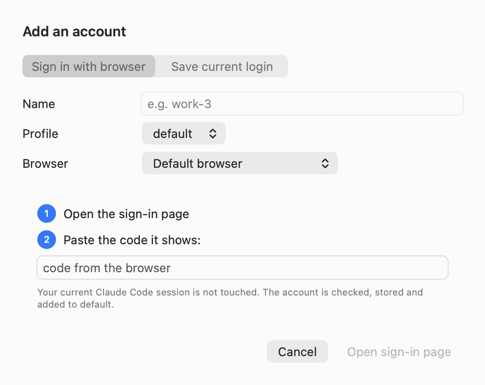</p>

Type the name, pick the browser, click **Open sign-in page**, sign in, and
paste the code into the sheet. The app runs both `cs login` steps for you. **Save current login** is the other route: run `/login` in
Claude Code as the new account, then save that login under a name
(`cs add` in a terminal).

### Read cs status

```sh
cs status
```

<p align="center">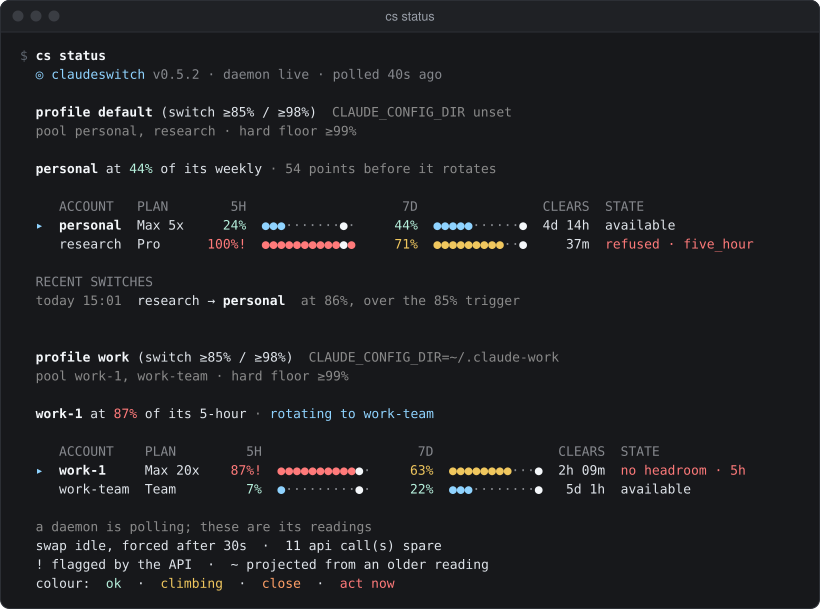</p>

This is what it looks like once you have both profiles from
[step 4](#4-a-second-profile-for-work). Reading the `default` block from the
top:

- **`v0.5.3 · daemon live · polled 40s ago`**: the binary's version, whether
  the daemon is live or in dry run, and how fresh the readings are.
- **`profile default (switch ≥85% / ≥98%)`**: the profile, and the thresholds
  it rotates at: 85% of the session (5-hour) window or 98% of the week.
- **`CLAUDE_CONFIG_DIR unset`**: this profile is plain `~/.claude`, the
  Claude Code you get when you type `claude`.
- **`pool personal, research · hard floor ≥99%`**: the accounts it can rotate
  between. Past the hard floor it swaps mid-turn rather than waiting for a
  pause.
- **`personal at 44% of its weekly · 54 points before it rotates`**: the live
  account, its binding window (whichever is closer to its threshold), and the
  room left.
- The table, one row per account. `▸` marks the live one. **5H** and **7D**
  are the session and weekly utilization, with a dot bar and a larger dot at
  the threshold. **CLEARS** is when the binding window resets. **STATE** is
  `available`, `refused` (the API turned it away; it shows which window and
  when it clears), `no headroom` and so on. `!` after a figure means the API
  itself flagged it.
- **RECENT SWITCHES**: the last rotations, with why.

The footer says where the readings came from (here, the daemon) and what the
colours mean.

## 3. Watch it decide

### cs why

```sh
cs why
```

<p align="center">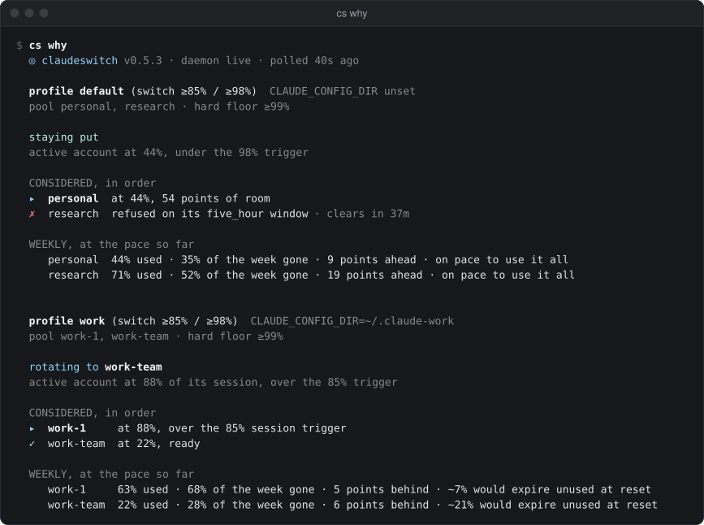</p>

`cs why` gives the decision for each profile and the reasoning, account by
account:

- `default` is **staying put**: personal is at 44%, under its trigger.
  research is crossed out (`✗`) because it is refused on its session window,
  with 37 minutes until it clears.
- `work` is **rotating to work-team**: work-1 is at 88% of its session, over
  the 85% trigger, and work-team (`✓`) is at 22% and ready.
- **WEEKLY, at the pace so far** compares how much of each week is used with
  how much of the week has gone. "on pace to use it all" is fine.
  "~21% would expire unused" means that account has room to spare.

### The popover

Click the rings in the menu bar.

<p align="center">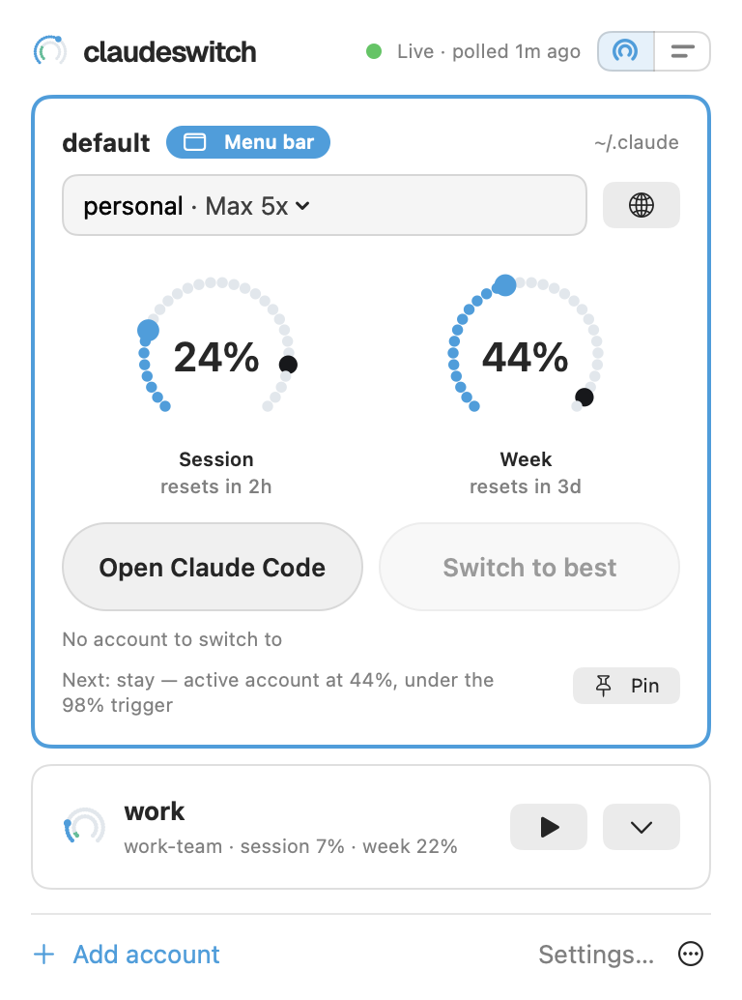</p>

The top line is the daemon: **Live** (green) or **Dry run** (orange), and when
it last polled. Below it, one card per profile. The card for the profile the
menu bar follows is open and marked **Menu bar**:

- **personal · Max 5x** is the live account and its plan. Click it to pick
  another account from the pool by hand.
- The two **dials** are the live account's session and week. The blue dots
  fill up to the reading, and the figure is in the middle. The **larger dark
  dot is the threshold**: on the session dial it sits at 85%, on the week
  dial at 98%. When the blue dots reach it, rotation moves the profile to
  another account.
- **Switch to best** names the account it would move to. Here it is greyed
  out with "No account to switch to", because research is refused.
- **Next:** is the same decision `cs why` gives.

The `work` profile is a compact row: its own small rings, its live account and
its figures. The chevron opens it.

The menu-bar glyph tells you the same at a glance, without opening anything:

<p align="center">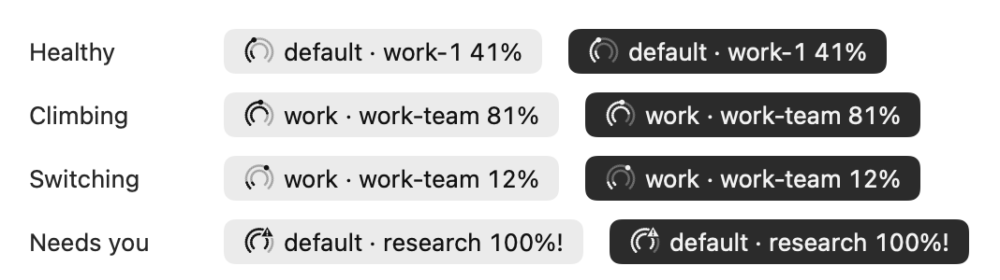</p>

**Healthy** has room. **Climbing** is near its threshold. **Switching** is
mid-rotation, with the small dot at the incoming account's week. **Needs
you** has a warning mark and a trailing `!`: the live account was refused or
needs signing in again.

### Dry run and live

So far the daemon has only been reporting. Leave it in dry run for a day if
you can, and look at what it would have done:

```sh
cs audit --kind decision
```

When its choices match yours, let it act:

```sh
cs daemon live
```

The popover's top line turns from **Dry run** to **Live**. From now on, when
the live account crosses its threshold, the daemon swaps the credential
between turns. Claude Code picks the new account up on its next request: no
restart, and the session carries on. `cs daemon dry-run` puts it back. The
same switch is in **Settings → Daemon**.

## 4. A second profile for work

A **profile** is one Claude Code config directory with its own pool of
accounts. Keeping work separate means work's sessions only ever rotate
between work accounts.

Sign in to the work accounts first:

```sh
cs login work-1 --direct      # then: cs login work-1 --code <the-code>
cs login work-team --direct   # then: cs login work-team --code <the-code>
```

Then make the profile, with those two as its pool, signed in as work-1:

```sh
cs profile create work --pool work-1,work-team --seed work-1
```

This makes `~/.claude-work`, links your `settings.json`, `CLAUDE.md`,
skills, commands and agents from `~/.claude` so one edit serves both, copies
your MCP servers, and writes the profile to the config. Your other accounts
stay in `default`. **New profile** in **Settings → Profiles** does the same.

Start Claude Code in it:

```sh
cs run work
```

`cs run work` is `claude` with `CLAUDE_CONFIG_DIR` set to `~/.claude-work`.
Arguments after `--` go to `claude`: `cs run work -- --resume`.

```sh
cs profile list
```

<p align="center">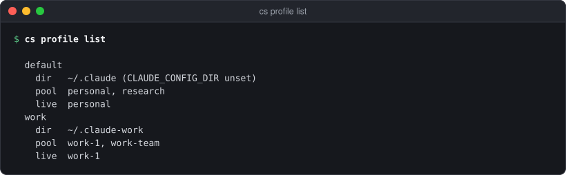</p>

One daemon drives both profiles. `cs status` and `cs why` now show a block
for each, as in the screenshots above. To switch one by hand:

```sh
cs use work-team --profile work
```

<p align="center"></p>

### Follow a profile in the menu bar

The menu bar follows one profile at a time. Open the `work` row's chevron in
the popover and click **Show in menu bar** next to its name. The glyph and
text switch to `work · work-team 7%`, and the work card becomes the open one
marked **Menu bar**. **Settings → Profiles** has the same choice as
**Shown in menu bar** on each profile.

## 5. Claude in Chrome

The Claude in Chrome extension has its own claude.ai login. After a rotation
Claude Code is on a different account, and the browser tools stop answering
("not connected", or "both must use the same claude.ai account").
claudeswitch cannot move the extension's login. Instead it uses your Chrome
profiles, so that each account's Chrome profile is signed in as that account.

There are two ways to arrange it.

**One Chrome profile per profile.** Every account in `work` uses your "Work"
Chrome profile. Simple, but after each rotation the extension there is still
signed in to the previous account, and needs one sign-in.

```sh
cs chrome profiles                  # your Chrome profiles, and who uses each
cs profile set work chrome "Work"
```

In the app: **Settings → Profiles**, open the profile, and pick it under
**Claude in Chrome → Chrome profile**. The default is Chrome's last used.

<p align="center">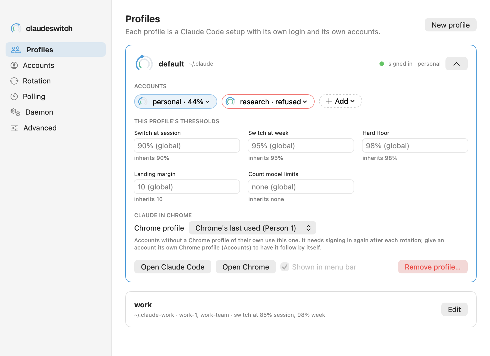</p>

**One Chrome profile per account.** Each account has a Chrome profile of its
own, and browser tasks follow every rotation by themselves, with no sign-in
needed. Use one you already have, or let claudeswitch make a new one:

```sh
cs chrome add research --existing "Research"   # research uses your "Research" Chrome profile
cs chrome add personal                         # a new Chrome profile for personal
```

`cs chrome add` without `--existing` opens the new profile at the claude.ai
sign-in and the extension's Web Store page. Sign in to claude.ai as that
account, add Claude in Chrome, and sign the extension in as the same account.
In the app, the same choice is **Chrome profile** in an account's ⋯ menu in
**Settings → Accounts**: the same as its profile's, one of your Chrome
profiles, or a new one.

<p align="center"></p>

An account uses its own Chrome profile if it has one, else its profile's,
else Chrome's last used.

### When the card says to sign in

Here `work` shares the "Work" Chrome profile, and has just rotated from
work-1 to work-team. The extension in "Work" is still signed in as work-1, so
the work card says so:

<p align="center">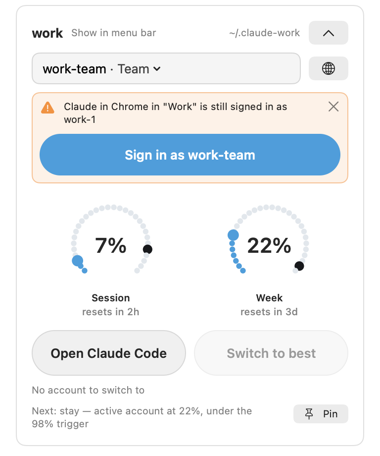</p>

Click **Sign in as work-team**. It opens the "Work" Chrome profile at the
claude.ai and Claude in Chrome sign-in pages. Sign in to both as work-team.
The × hides the banner until the next rotation. From a terminal:

```sh
cs chrome signin work-team
```

The daemon's notification and `cs use` say the same after a rotation. If a
browser tool fails inside Claude Code, the plugin tells Claude which account
Claude Code is on and this command.

The globe next to the account picker on each card opens the live account's
Chrome profile (`cs chrome <id>`). More, including exactly what claudeswitch
reads of Chrome's files (only the profile list):
[GUIDE → Claude in Chrome](GUIDE.md#claude-in-chrome).

## 6. Inside Claude Code

### The plugin

Inside Claude Code:

```
/plugin marketplace add https://github.com/bogdan-alexandrescu/claudeswitch
/plugin install cs@claudeswitch
```

Start a new session and run `/cs setup`. It checks the binary, adds the status
line if `cs setup` did not, and runs `cs doctor`.

From then on every session starts with two lines of context, so Claude knows
where quota stands:

```
[claudeswitch] active personal · session 24% (resets 3h47m) · week 44% (resets 4d15h)
[claudeswitch] rotates at session 85% / week 98%, mid-turn at 99% · daemon running, rotates automatically
```

More than two lines means something needs attention: a refused account, a
daemon in dry run, a switch that is due
([→ what each means](GUIDE.md#every-session-starts-knowing-where-quota-stands)).

### The status line

```
personal  session ▓▓░░░░░░░░ 24% 3h48m  ▸week ▓▓▓▓░░░░░░ 44% 4d15h
```

The live account, then the session and the week with when each resets. `▸`
marks the window that binds. Bars turn yellow at 60% and change colour again
at the threshold and the hard floor. Past the threshold the line says what
happens next, such as `· rotating to work-team`. In a `cs run work` session
it starts with `work`. It reads saved state only, so it costs nothing to
draw.

### /cs

`/cs` works like `cs` in a terminal, and you can also just ask:

```
/cs status          how much quota is left?
/cs why             why didn't it switch?
/cs switch work-team   move me to work-team
```

`/cs switch` changes the live account at once, without asking, because a swap
is hot and reversible. The session you are in carries on with the new account
from its next request. `/cs session` adds up how much a stretch of work used
across every account it touched. The full table:
[README → Inside Claude Code](../README.md#inside-claude-code).

## 7. Everyday use and troubleshooting

### Appearance, dials and bars

The ⋯ menu at the foot of the popover has **Appearance** (System, Light or
Dark) and **Show usage as** (Dials or Bars).

<p align="center">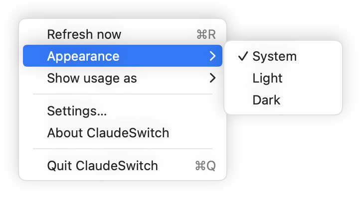</p>

System follows your Mac. Light or Dark keeps the app in one appearance. Bars
show the same dots in two rows, which takes less height:

<table>
  <tr>
    <td align="center">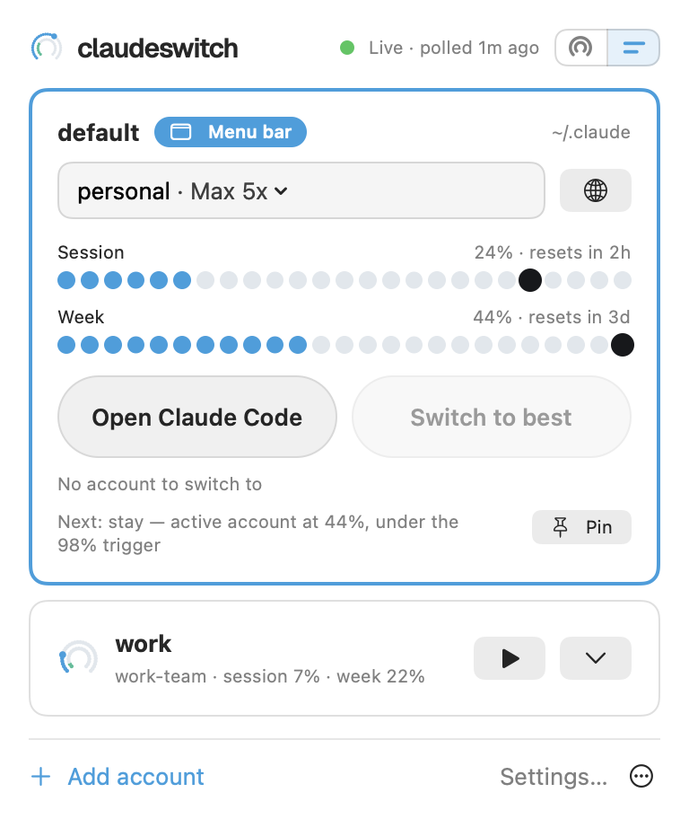</td>
    <td align="center">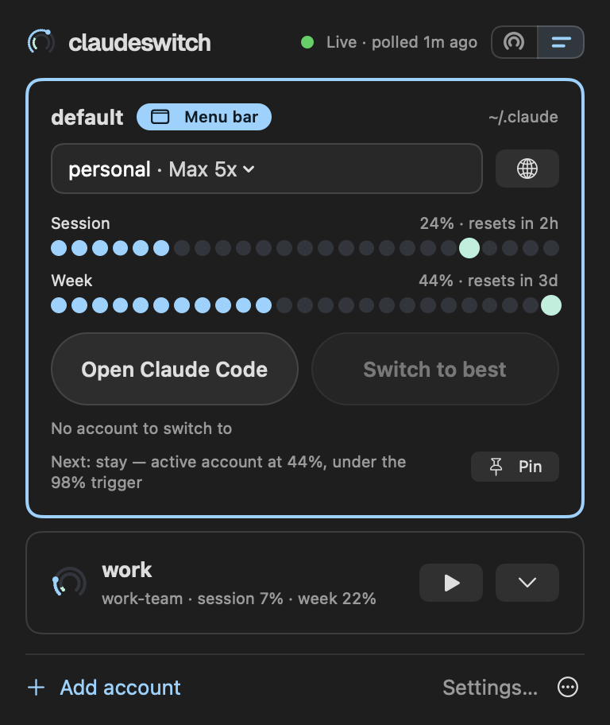</td>
  </tr>
</table>

The small switch at the top right of the popover flips between dials and
bars too. Both settings are also in **Settings → Advanced → This app**, with
the terminal **Open Claude Code** uses and **Icon only in the menu bar**.

<p align="center"></p>

### cs doctor

When something looks wrong, start here:

```sh
cs doctor
```

<p align="center"></p>

It checks the config, the vault, the daemon, each profile's live credential,
the usage API, the call budget, the status line and the plugin, and says how
to fix each one that fails. `cs doctor --verify` also checks that every
stored credential still works.

### "It didn't switch"

Run `cs why`. It says, account by account, why it stayed. The usual reasons:

- **The daemon is in dry run.** The popover says **Dry run**; `cs why` says
  what it would do. `cs daemon live`.
- **The account is under its threshold.** Rotation waits for 85% of the
  session or 98% of the week. A profile can have its own thresholds
  (Settings → Profiles).
- **No other account has room.** Every other account in the pool is refused,
  over its threshold, or would land too close to it (the landing margin).
  `cs status` shows when each one clears.
- **The profile is pinned.** **Pin** on the card, or `cs use`, holds the
  profile on one account until you unpin it.
- **It is waiting for a pause.** Below the hard floor it swaps between turns,
  and waits up to 30 seconds for one.

`cs audit --kind decision` shows the decisions it made earlier.

### Readings stop updating (429)

The usage API locks an account out for 10 to 15 minutes after a burst of about
24 calls, answering 429. claudeswitch spaces its calls to stay well under
that, and a 429 clears by itself. Wait it out. Do not lower `poll_hot` below
its default, and avoid running other tools that read the usage API for the
same accounts.

### An account needs signing in again

A credential dies when its refresh token expires or is revoked. The account
shows a 401 or "needs a login", the glyph shows **Needs you** if it is the
live one, and `cs doctor` names it. Sign in again:

```sh
cs login work-1 --direct
cs login work-1 --code <the-code>
```

or **Sign in again** in the account's ⋯ menu in **Settings → Accounts**. The
daemon renews credentials before they expire and tests idle ones once a day,
so this is rare, and it tells you days ahead when a refresh token is about
to expire. If a swap ever kept a login aside, `cs recovery` lists it
([→ Recovery copies](GUIDE.md#recovery-copies)).

### Where next

- [The documentation index](README.md): every app control and every CLI
  command, one page per surface or command group.
- [README → The cs CLI](../README.md#the-cs-cli): every command.
- [README → Configuration](../README.md#configuration) and
  [GUIDE → Configuration](GUIDE.md#configuration): every setting and why its
  default is what it is.
- [GUIDE → Multiple Claude Code profiles](GUIDE.md#multiple-claude-code-profiles):
  profiles in depth.
- [README → Troubleshooting](../README.md#troubleshooting) and
  [README → Uninstall](../README.md#uninstall).
