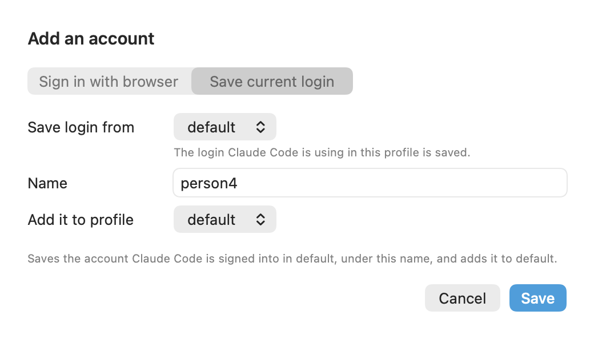

# Add account

The sheet that adds an account, or signs in to one again: through a browser, or by saving the login Claude Code has now.

See also: [cs accounts → login, add](../cli/accounts.md) · [GUIDE → Adding an account](../GUIDE.md#adding-an-account) · [Settings → Accounts](settings-accounts.md)

It opens from **+ Add account** in the popover (for the followed profile),
**Add account** in [Settings → Accounts](settings-accounts.md) (no profile
chosen), and **Sign in again...** in an account's ⋯ menu (that account, in
its profile).

## Sign in with browser

| field | what it is | default |
|---|---|---|
| **Name** | the account's name in claudeswitch. Any name works; it is pinned to whichever seat signs in | |
| **Profile** | the profile whose pool it joins | the profile it was opened from |
| **Browser** | the browser the sign-in page opens in. A browser signs in as the account it already holds, so pick one signed in to this account | Default browser |

**Open sign-in page** runs `cs login <name> --direct --no-open` (with
`--profile` and `--browser` when set) and opens the page. Sign in, then paste
the code the page shows; the app finishes with `cs login <name> --code
<code>`. The credential is checked, stored and added to the profile. Your
current Claude Code session is not touched.

The CLI refuses a mismatch: a name already pinned to another seat, or a seat
already stored under another name. The sheet shows its message.

## Save current login

| field | what it is | default |
|---|---|---|
| **Save login from** | the profile whose Claude Code login is saved | the followed profile |
| **Name** | the name to save it under, suggested from the account | suggested |
| **Add it to profile** | the profile whose pool it joins | the same profile |

**Save** runs `cs add <name> --from <profile> --profile <profile>`. Use it after
`/login` in Claude Code as the account you want to add. The name in the
screenshot is a placeholder.

[← Documentation index](../README.md)
