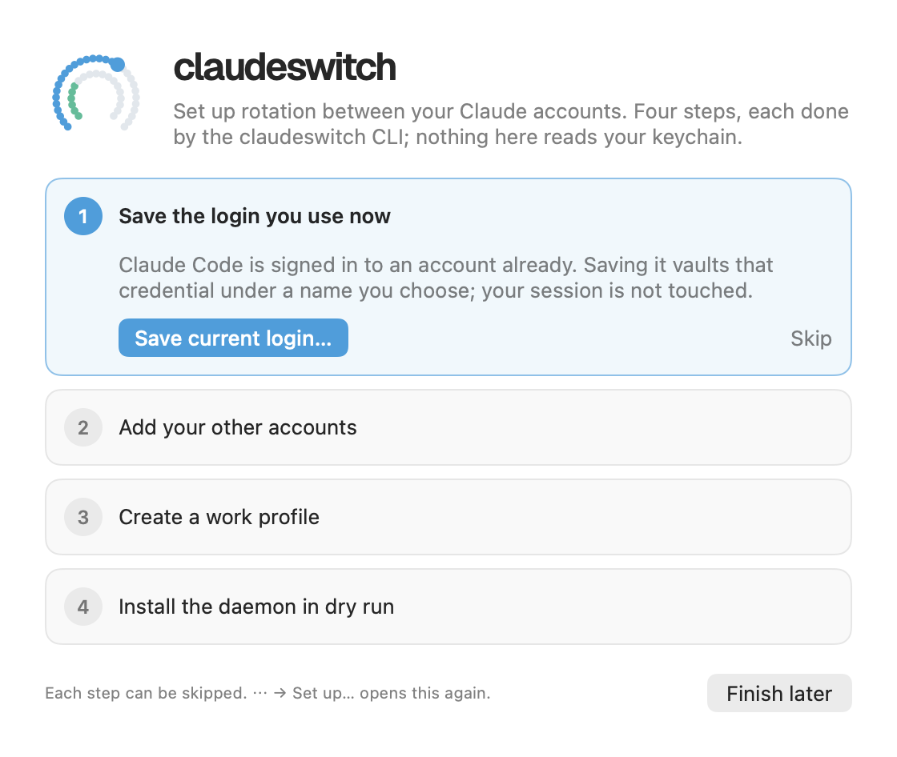
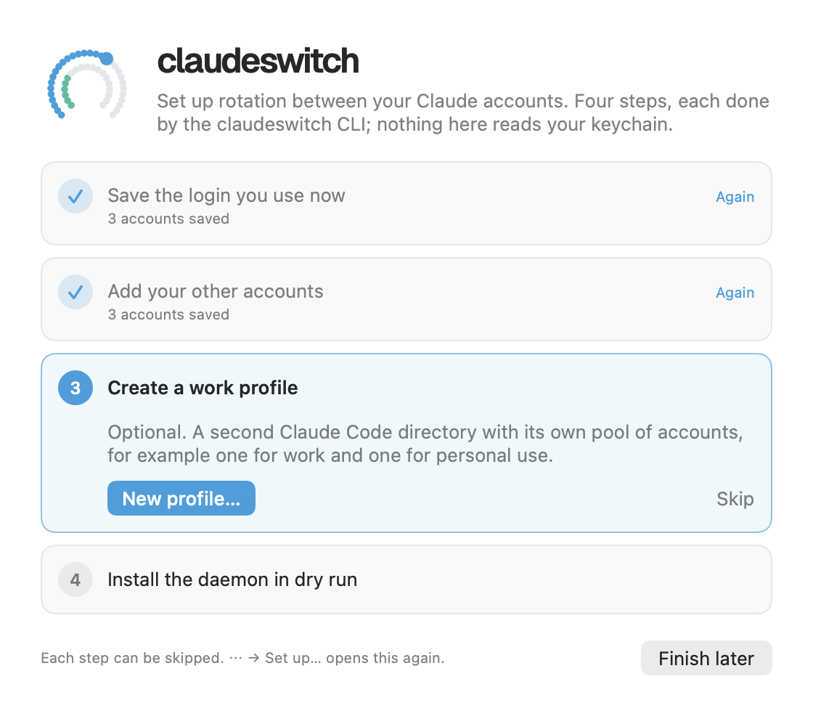

# First-run setup

The window that opens when the app starts and there is no claudeswitch
config yet. It does what `cs setup` does, one step at a time, through the
CLI's JSON forms.

See also: [Add account](add-account.md) · [Settings → Profiles](settings-profiles.md) · [Settings → Daemon](settings-daemon.md) · [cs setup](../cli/setup.md)

## When it opens

- **At launch**, when the config file is missing: the path
  `cs config --json` reports, or `~/.config/claudeswitch/config.toml` when
  the CLI cannot be read.
- **From the popover's ⋯ menu → Set up…**, at any time.

**Finish later** closes it. Nothing is lost: each step's state is read again
from the CLI when the window opens.

## The steps

Each step can be skipped. A step counts as done when what it does is
already true, whether this window did it or not. A done or skipped step
has **Again** or **Do it now** to open it again.

| step | what it does | runs | done when |
|---|---|---|---|
| **1. Save the login you use now** | opens [Add account](add-account.md) on **Save current login**, with the name the CLI suggests | `add <name> --json` | the config has an account |
| **2. Add your other accounts** | opens [Add account](add-account.md) on **Sign in with browser**, as often as you like. **Continue** moves on once one account is saved | `login <id> --direct --json`, then `login <id> --code <code> --json` | you press Continue |
| **3. Create a work profile** | optional. Opens the [New profile](settings-profiles.md) sheet | `profile create --json` | a profile other than `default` exists |
| **4. Install the daemon in dry run** | installs the background service in dry run: it reads usage and decides, but never switches. Turn it live in [Settings → Daemon](settings-daemon.md) | `daemon install --dry-run --json` | the service is installed |

## The config it starts

`add --json` writes each account into the config, but does not create the
file, and the CLI has no JSON form of `setup` or `init`. So before steps 1
to 3 the window writes an empty config where the CLI looks for it (mode
0600, its folder 0700), holding three comment lines and no settings. Every
setting keeps its default; an existing config is never touched.

## Without the binary

Every step runs `claudeswitch`. When it is missing the window says so with
the install steps, and the step buttons are off until it is found.

[← Documentation index](../README.md)
