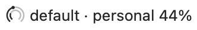

# Menu bar

The menu-bar item: the live Twin rings glyph, the followed profile's live account and its utilization.

See also: [Popover](popover.md) · [Settings → Advanced](settings-advanced.md) · [Concepts → the two windows](../concepts.md#the-two-windows-and-thresholds) · [BRAND.md](../BRAND.md)

## The label

The text after the glyph is `<profile> · <account> <percent>`:

| part | what it is |
|---|---|
| profile | the profile the menu bar follows; left out when there is only one profile |
| account | that profile's live account |
| percent | the account's binding utilization: whichever of the session (5-hour) and week windows is closer to its switch threshold |
| `!` at the end | the account is over its threshold, was refused, or needs signing in again |

Two other forms:

- `cs ...` while the app is still reading its first state.
- A question mark instead of the rings when the `claudeswitch` binary is
  missing or older than 0.5.1. Open the popover for how to install it.

The menu bar follows the profile marked **Menu bar** in the
[popover](popover.md#cards). **Show in menu bar** on another card, or
**Shown in menu bar** in [Settings → Profiles](settings-profiles.md), changes
it. With no choice made, it follows `default`.

The label reads the state file only. It is redrawn when the state changes and
never animates, so Reduce Motion has nothing to stop.

## The glyph

The glyph is two rings of dots. The **outer ring is the week**, the **inner
ring is the session**, each lit up to the live account's reading. A small dot
on the outer ring, the satellite, sits at the week's reading. It is a template
image, so macOS draws it in the menu bar's own colour, light or dark; trouble
is shown by shape (a warning mark and the trailing `!`), never by colour
alone.

| state | when | what changes |
|---|---|---|
| **Healthy** | the live account has room | the rings show the readings; the satellite sits at the week |
| **Climbing** | the live account is near its switch threshold | the same drawing, with the rings nearly full |
| **Switching** | rotation has decided to move the profile to another account | the satellite moves to the incoming account's week |
| **Needs you** | the live account was refused, or needs signing in again | a warning mark replaces the satellite, and the text ends in `!` |

VoiceOver reads the item as, for example, "ClaudeSwitch: default · personal,
week 44%, session 24%", followed by "nearing its switch threshold",
"switching to work-team" or "personal was refused" when they apply.

## Icon only

**Icon only in the menu bar** in [Settings → Advanced](settings-advanced.md)
hides the text and keeps the rings. Default: off. It saves space on a crowded
menu bar, or on a MacBook whose notch hides items: see
[README → Troubleshooting](../../README.md#troubleshooting).

[← Documentation index](../README.md)
