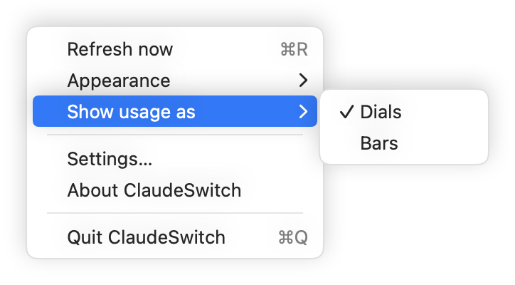

# Popover

The window that opens from the menu-bar glyph: the daemon, one card per profile, and the actions you use day to day.

See also: [Menu bar](menu-bar.md) · [Claude in Chrome in the app](chrome.md) · [cs status](../cli/status.md) · [cs accounts](../cli/accounts.md) · [Concepts](../concepts.md)

<table>
  <tr>
    <td align="center"></td>
    <td align="center"></td>
  </tr>
  <tr><td align="center">Dials</td><td align="center">Bars</td></tr>
</table>

Dark mode: [dials](../images/popover-dials-dark.png),
[bars](../images/popover-bars-dark.png).

## Header

| control | what it does | default |
|---|---|---|
| **Live** / **Dry run** | the daemon's mode: green when live, orange in dry run. Then how long since it polled, or "not polling for N m" when it has stopped. Change it in [Settings → Daemon](settings-daemon.md) or with `cs daemon live` / `cs daemon dry-run` | as installed: dry run |
| dials / bars switch | the two small buttons at the top right: show session and week as dials or as bars. The same setting as **Show usage as** in the ⋯ menu and **Usage in the popover** in [Settings → Advanced](settings-advanced.md) | Dials |

## Cards

One card per profile. The card of the profile the menu bar follows is open,
outlined in the accent colour and marked **Menu bar**. The others are compact
rows with their own small rings (week outside, session inside), their live
account, its session and week, a **▶** that opens Claude Code in that profile,
and a chevron that opens the card. An opened card has **Show in menu bar**
next to its name, which makes the menu bar follow it, and a chevron to close
it.

An open card shows, top to bottom:

| element | what it shows or does | CLI |
|---|---|---|
| name and directory | the profile, and its config directory (`~/.claude` for `default`) | `cs profile list` |
| account picker | the live account and its plan. Pick another account of the profile's pool to switch to it now. Accounts that cannot be used say why | `cs use <id> --profile 
` |
| globe | opens the live account's Chrome profile. Hidden where Chrome is not supported | `cs chrome open <id>` |
| banners | Claude in Chrome sign-in, card errors and problems (below) | |
| **Session** and **Week** | the live account's two windows, as dials or bars (below) | `cs status` |
| per-model limits | an account's per-model weekly limits, each with its own bar and reset | `cs status` |
| **Open Claude Code** | opens your terminal running Claude Code in this profile. The terminal is set in [Settings → Advanced](settings-advanced.md) | `cs run 
` |
| **Switch to best** | moves the profile to the account rotation would choose now, named under the button with its utilization. Greyed out, with the reason below it, when there is none. When the best has no more room than the live account it reads **Already on the best**, greyed out, with the next best underneath; room is points below each window's own trigger, as `cs why --json` reports it (`on_best`) | `cs use <best> --profile 
` |
| **Next:** | what rotation will do next and why: stay, switch to an account, or wait | `cs why --profile 
` |
| **Pin** / **Pinned** | Pin holds the profile on its live account and turns rotation off for it. Pinned (filled) lets it rotate again | `cs account pin <id>` / `cs account unpin --profile 
` |

### Dials and bars

Each window is drawn as dots: 30 in a dial, 25 in a bar.

- **Lit dots** run up to the reading, in the accent colour. The figure is in
  the middle of a dial, or at the right of a bar, with when the window
  resets.
- **The threshold dot** is the larger dark dot (light green in dark mode). It
  sits at the profile's switch threshold: `switch_at` (85% by default) on the
  session, `switch_at_weekly` (98%) on the week. A profile with its own
  thresholds shows its own. When the lit dots reach it, rotation moves the
  profile on.
- **Warnings** keep their own colours: a refused or failing account is drawn
  in the warning colour, whichever form you use.

## Banners

Banners appear on the card they concern.

| banner | when | what to do |
|---|---|---|
| **Claude in Chrome in "Work" is still signed in as work-1** (amber) | the profile's accounts share one Chrome profile, and rotation moved it to another account | **Sign in as work-team** opens that Chrome profile at the sign-in pages (`cs chrome signin work-team`). × hides it until the next rotation. See [Claude in Chrome in the app](chrome.md) |
| **Could not switch …** (red) | an action on the card failed, for example `use` refused. It gives the CLI's message, and when the refusal ends, **Try again at …** | wait, or follow the message. × dismisses it |
| a problem line (red, with a triangle) | the live account's last reading failed: a 401, a timeout, no stored credential | sign in again (`cs login <id> --direct`), or see [cs setup → doctor](../cli/setup.md) |

<table>
  <tr>
    <td align="center"></td>
  </tr>
</table>

When the `claudeswitch` binary is missing or too old, the popover shows that
in place of the cards, with how to install it.

## Footer

| control | what it does |
|---|---|
| **+ Add account** | opens [Add account](add-account.md) for the followed profile. Greyed out until the binary is found |
| **Settings...** (⌘,) | opens the Settings window at [Profiles](settings-profiles.md) |
| ⋯ | the menu below |

### The ⋯ menu

<table>
  <tr>
    <td align="center"></td>
    <td align="center"></td>
  </tr>
</table>

These two images are drawn by the app's render mode as a facsimile of the
menu, since a live menu cannot be captured off screen.

| item | what it does | default |
|---|---|---|
| **Refresh now** (⌘R) | reloads what the app shows: the state file, `cs why`, the Chrome and account lists and the profiles. It does not poll the usage API; the daemon does that | |
| **Appearance** | System, Light or Dark. System follows your Mac; Light or Dark keeps the popover and Settings in that appearance | System |
| **Show usage as** | Dials or Bars | Dials |
| **Settings...** | opens Settings | |
| **About ClaudeSwitch** | the app's version | |
| **Quit ClaudeSwitch** (⌘Q) | quits the app. The daemon keeps running | |

## What it reads

The popover reads `~/.local/state/claudeswitch/state.json` on every save, and
runs `cs why --json`, `cs chrome list --json` and `cs account list --json`
every 20 seconds and after each action. It never reads the keychain and never
calls the usage API. The commands it runs are listed in
[APP_CLI.md](../APP_CLI.md).

[← Documentation index](../README.md)
