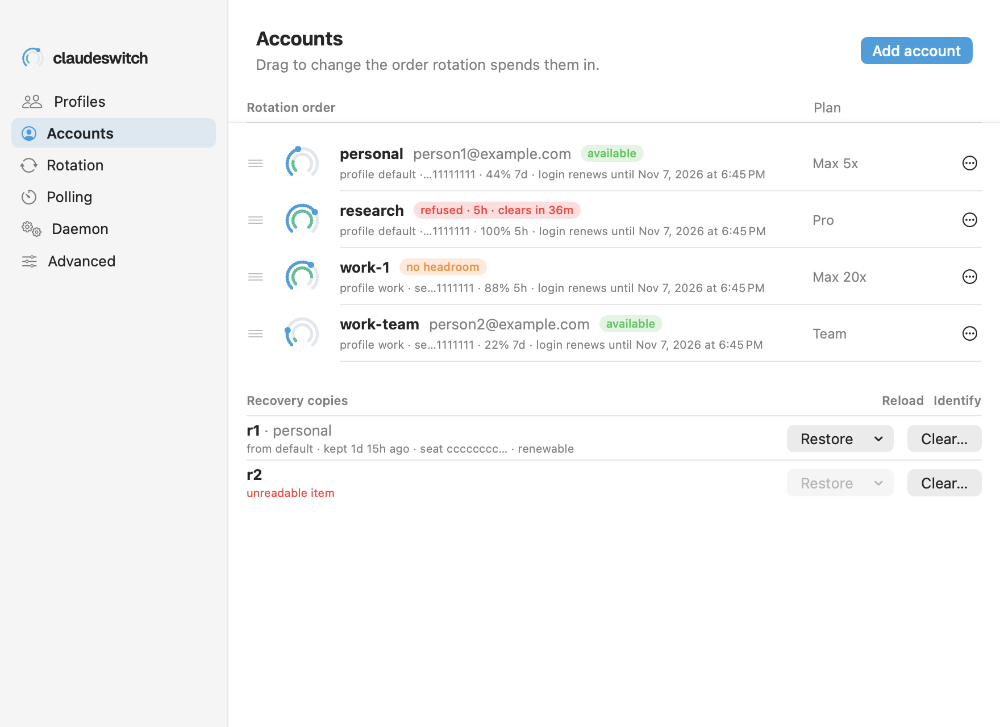

# Settings → Accounts

Every stored account in rotation order, with what you can do to each, and the recovery copies.

See also: [cs accounts](../cli/accounts.md) · [Add account](add-account.md) · [Claude in Chrome in the app](chrome.md) · [GUIDE → Recovery copies](../GUIDE.md#recovery-copies)

## The list

One row per account, in the order rotation tries them. Each row has:

- small rings: the account's week (outer) and session (inner);
- its name, its email when claudeswitch recorded one, and its state:
  `available`, `no headroom`, `refused · 5h · clears in 36m`, `needs login`
  and so on;
- a detail line: its profile, its own Chrome profile if it has one, its seat
  (shortened), its binding figure, and how long its login renews for;
- its plan.

Drag a row by its handle to change the order (`cs priority <ids...>`).

**Add account** at the top right opens [Add account](add-account.md) with no
profile chosen.

## An account's ⋯ menu

| item | what it does | CLI |
|---|---|---|
| **Rename...** | renames the account everywhere: config, vault, state, Chrome mapping. Needs the daemon stopped | `cs account rename <old> <new>` |
| **Move to profile** → **Move to work...** | moves it to another profile's pool, after a confirmation | `cs profile pool <from> remove <id> --to 
` |
| **Sign in again...** | opens [Add account](add-account.md) for this account, to replace a dead credential | `cs login <id> --direct` |
| **Move up** / **Move down** | one step in the rotation order | `cs priority` |
| **Open Chrome** | opens the Chrome profile this account uses | `cs chrome open <id>` |
| **Chrome profile: …** | which Chrome profile Claude in Chrome uses for this account: **Same as its profile** (the default), one of **Your Chrome profiles**, or **Create a new one** | `cs chrome forget <id>`, `cs chrome add <id> --existing <name>`, `cs chrome add <id>` |
| **Delete...** | removes the account and its stored credential, after a confirmation that names the account and seat | `cs account delete <id>` |

## Recovery copies

When a swap or a sign-in replaced a live credential that claudeswitch could
not attribute to an account, it kept the old one aside as a recovery copy.

| control | what it does | CLI |
|---|---|---|
| **Show** / **Reload** | reads the list | `cs recovery` |
| **Identify** | looks up who each copy signs in as, one identity call each | `cs recovery --identify` |
| **Restore** → account | puts the copy back as that account's stored credential, after a confirmation | `cs recovery restore <slot> <id>` |
| **Clear...** | deletes the copy | `cs recovery clear <slot>` |

A copy that cannot be read says so in red and cannot be restored.

[← Documentation index](../README.md)
