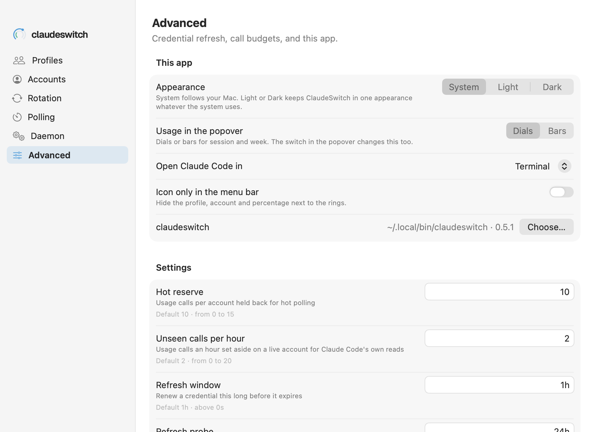

# Settings → Advanced

The app's own preferences, and the advanced call-budget and credential-refresh settings.

See also: [Popover](popover.md) · [Menu bar](menu-bar.md) · [cs config](../cli/config.md) · [GUIDE → Advanced](../GUIDE.md#advanced)

## This app

These are stored by the app, not in claudeswitch's config.

| row | what it does | default |
|---|---|---|
| **Appearance** | System follows your Mac. Light or Dark keeps ClaudeSwitch in one appearance whatever the system uses. Also in the popover's ⋯ menu | System |
| **Usage in the popover** | Dials or Bars for the session and week. The switch in the popover and **Show usage as** in the ⋯ menu change it too | Dials |
| **Open Claude Code in** | the terminal **Open Claude Code** and **▶** use: Terminal, iTerm, Ghostty or Warp. It runs `cs run <profile>` there | Terminal |
| **Icon only in the menu bar** | hides the profile, account and percentage next to the rings | off |
| **Check for updates** | once a day, one call to GitHub's latest release; **Check now** checks at once. Off makes no call. See [Updates](updates.md) | on |
| **Notifications with actions** | the app's own notifications: Undo and Pin here on a rotation, Sign in when an account needs it. See [Shortcuts → Notifications](shortcuts.md#notifications) | on |
| **Switch to best hotkey** | a global key for Switch to best on the followed profile; click the key to record another. See [Shortcuts](shortcuts.md#the-hotkey) | off, ⌥⌘S |
| **claudeswitch** | the binary the app runs, and its version. **Choose...** picks another one. Without a choice the app looks in `~/.local/bin`, then `PATH` and the usual Homebrew and Go locations | found automatically |

The app needs claudeswitch 0.5.1 or later. The version shown in the
screenshot is example data.

## Settings

The `cs config` settings that are neither [Rotation](settings-rotation.md)
nor [Polling](settings-polling.md), built from `cs config schema --json` and
saved with `cs config set`. Change these only if you have measured better.

| row | key | what it does | default | range |
|---|---|---|---|---|
| **Hot reserve** | `hot_reserve` | usage calls per account held back for hot polling | 10 | 0 to 15 |
| **Unseen calls per hour** | `unseen_calls_per_hour` | usage calls an hour set aside on a live account for Claude Code's own reads | 2 | 0 to 20 |
| **Refresh window** | `refresh_window` | renew a credential this long before it expires | 1h | above 0s |
| **Refresh probe** | `refresh_probe` | also renew idle accounts this often, to catch a dead refresh token (`0s` disables) | 24h | at least 0s |

The reasoning behind the budget settings:
[GUIDE → Advanced](../GUIDE.md#advanced). Credential renewal:
[GUIDE → Keeping credentials alive](../GUIDE.md#keeping-credentials-alive).

[← Documentation index](../README.md)
