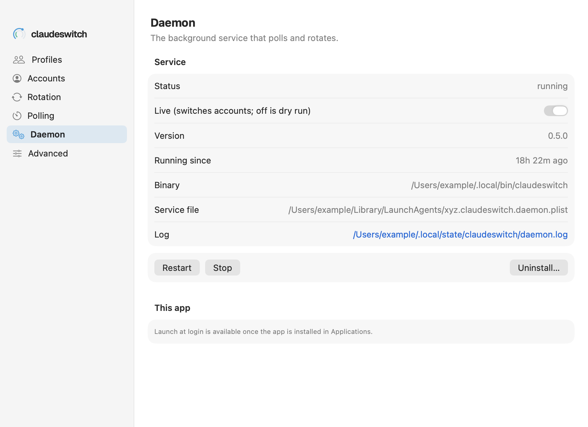

# Settings → Daemon

The background service that polls and rotates: its status, its mode, and starting, stopping, installing and removing it.

See also: [cs daemon](../cli/daemon.md) · [Concepts → dry run and live](../concepts.md#dry-run-and-live) · [GUIDE → Running as a daemon](../GUIDE.md#running-as-a-daemon)

The pane reads `cs daemon status --json` when Settings opens.

## Service

| row or control | what it shows or does | CLI |
|---|---|---|
| **Status** | running; loaded, not running; installed, stopped; or not installed | `cs daemon status` |
| **Live (switches accounts; off is dry run)** | turning it on asks first ("Turn the daemon live?"), then makes the daemon act in every profile. Off is dry run: it decides and logs, and changes nothing | `cs daemon live` / `cs daemon dry-run` |
| **Version** | the running daemon's build | |
| **Running since** | how long it has run | |
| **Binary** | the binary the service runs. A warning appears when that is not the binary this app uses | |
| **Service file** | the launchd plist (`~/Library/LaunchAgents/xyz.claudeswitch.daemon.plist`) | |
| **Log** | `~/.local/state/claudeswitch/daemon.log`; click to open it | |
| **Restart** | restarts it, for example after installing a new binary | `cs daemon restart` |
| **Stop** / **Start** | stops or starts it, leaving it installed | `cs daemon stop` / `cs daemon start` |
| **Uninstall...** | unloads the service and removes its file, after a confirmation. State, logs and stored accounts stay | `cs daemon uninstall` |
| **Install (dry run)** / **Install live...** (when not installed) | installs the service for the binary the app uses. Live asks first | `cs daemon install --dry-run` / `cs daemon install --live` |

The screenshot's version and paths are example data.

## This app

**Open ClaudeSwitch at login** starts the app when you log in. It is available
once the app is in `/Applications` or `~/Applications`; until then the pane
says so. Default: off.

[← Documentation index](../README.md)
