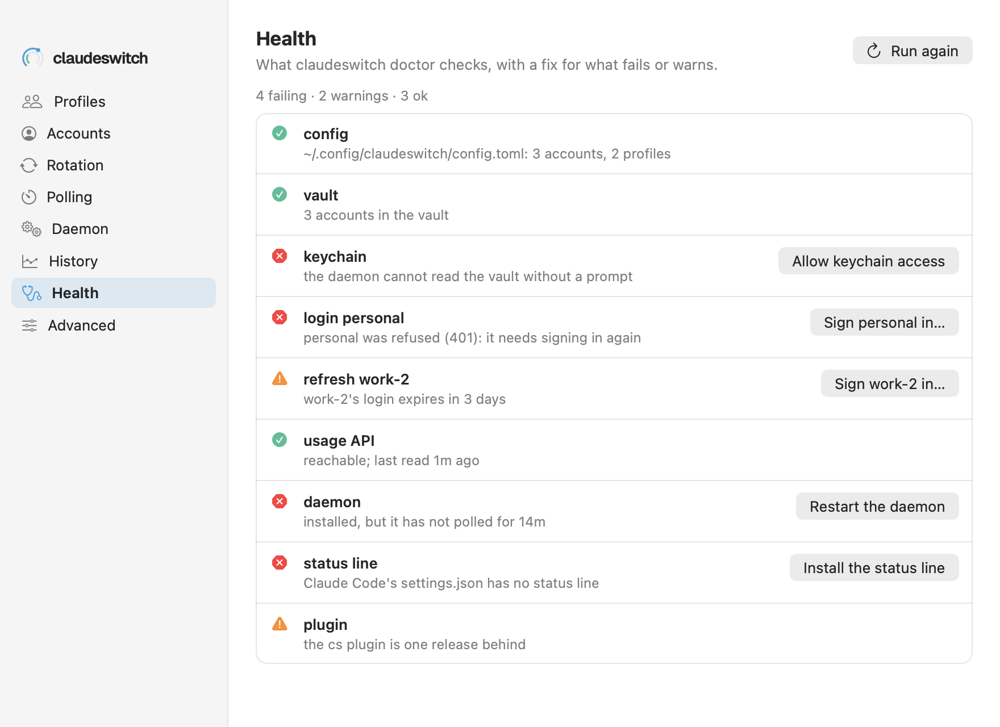

# Settings → Health

Every check `cs doctor` makes, each with its mark and message, and a Fix button for a failure or warning the app knows how to fix.

See also: [cs doctor](../cli/setup.md#cs-doctor) · [Settings → Daemon](settings-daemon.md) · [Add account](add-account.md)

The pane runs `cs doctor --json` when it first opens, and again with **Run
again** and after each fix. The line under the title counts the checks:
failing, warnings, ok, and when they last ran.

## A check

| part | what it shows |
|---|---|
| mark | ok (a tick in the second accent), warning (amber triangle), failing (red octagon), or a question mark for a status this app does not know |
| name and message | the check and what it found, as `cs doctor` words them |
| Fix button | on a failure or a warning whose `fix` is one of the actions below |

## Fix buttons

| `fix` from the CLI | button | what it does | CLI |
|---|---|---|---|
| `signin <account>` | **Sign personal in…** | opens [Add account](add-account.md) signing that account in again | `cs login <id> --direct` |
| `daemon restart` | **Restart the daemon** | restarts the service | `cs daemon restart --json` |
| `statusline install` | **Install the status line** | adds claudeswitch's status line to Claude Code's settings | `cs statusline install --json` |
| `keychain allow` | **Allow keychain access** | lets the daemon read the vault without a prompt | `cs keychain allow --json` |

A fix the app does not know (a newer CLI may add one) gets no button: the
message says what to do. A fix that fails shows the CLI's message under the
check. Warnings get a button as failures do (since 0.6.1), the "status line not set" note among them: `cs doctor` marks it `[info]`, which `--json` reports as `status` `warn`, `level` `info`, with `fix` `statusline install`. An ok row never has one.

`cs doctor` may read the keychain, so the pane runs it only when it opens or
you ask, never on a timer.

## With an older claudeswitch

`doctor --json` is new in the release that adds this pane. With an older
binary the pane says it needs a newer claudeswitch; `cs doctor` in a terminal
still works.

The screenshot is drawn from fixture data.

[← Documentation index](../README.md)
