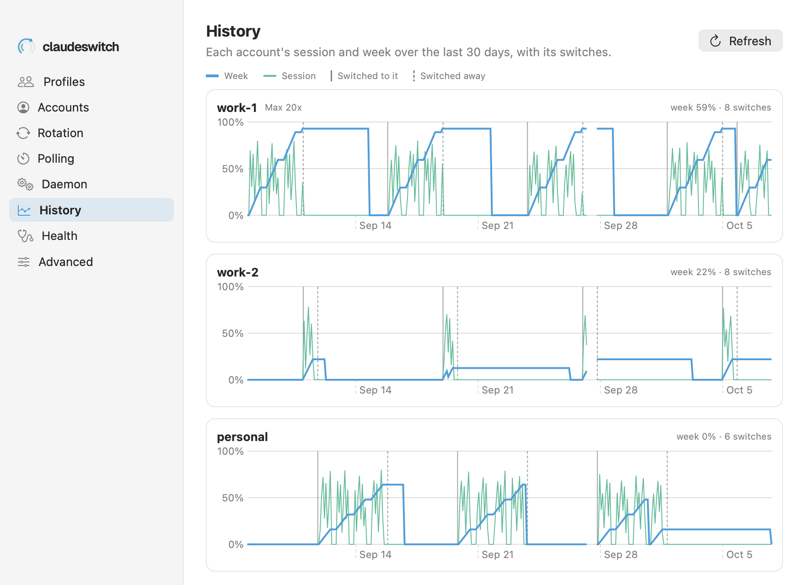

# Settings → History

Each account's session and week over the last 30 days, with the switches to and away from it.

See also: [cs history](../cli/claude-code.md#cs-history) · [Concepts → how rotation decides](../concepts.md#how-rotation-decides) · [Settings → Rotation](settings-rotation.md)

The pane runs `cs history --usage --days 30 --json` when it opens, and again
with **Refresh**. That is a series of readings per account, recorded by the
daemon as it polls, plus every switch.

## A chart per account

| mark | what it shows |
|---|---|
| thick line, in the accent | the week: the account's weekly utilization |
| thin line, in the second accent | the session: its 5-hour utilization |
| solid grey rule | rotation switched a profile **to** this account |
| dashed grey rule | rotation switched a profile **away** from it |
| top right | the week's latest figure and how many switches touched the account |

The colours are the rings': the week is the outer ring's accent, the session
the inner ring's. Each line is one point per hour (the hour's highest
reading). Where the daemon recorded nothing for more than six hours (it was
stopped, or the Mac slept) the line breaks rather than bridging the gap, and
a reading the daemon could not take is left out: an unknown figure is never
drawn as 0.

An account with no readings in the 30 days has no chart. With none at all the
pane says the daemon records them as it polls.

## With an older claudeswitch

`history --usage` is new in the release that adds this pane. With an older
binary the pane says it needs a newer claudeswitch, and nothing else changes.

The screenshot is drawn from fixture data (`macos/scripts/gen-feature-fixtures.py`).

[← Documentation index](../README.md)
