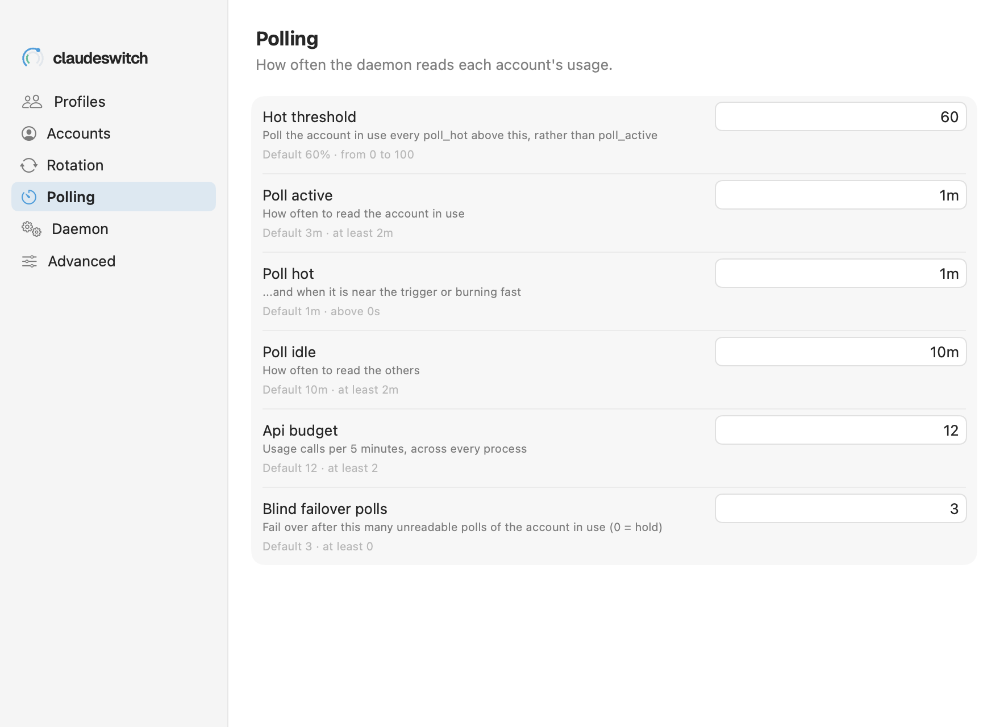

# Settings → Polling

How often the daemon reads each account's usage, and how many calls it may spend.

See also: [cs config](../cli/config.md) · [Concepts → the call budget and 429s](../concepts.md#the-call-budget-and-429s) · [GUIDE → Advanced](../GUIDE.md#advanced)

Built from `cs config schema --json` and saved with `cs config set`, like
[Rotation](settings-rotation.md). All are global.

| row | key | what it does | default | range |
|---|---|---|---|---|
| **Hot threshold** | `hot_threshold` | poll the account in use every `poll_hot` above this, rather than every `poll_active` | 60% | 0 to 100 |
| **Poll active** | `poll_active` | how often to read the account in use | 3m | at least 2m |
| **Poll hot** | `poll_hot` | ...and when it is near the trigger or burning fast | 1m | above 0s |
| **Poll idle** | `poll_idle` | how often to read the others | 10m | at least 2m |
| **Api budget** | `api_budget` | usage calls per 5 minutes, across every process | 12 | at least 2 |
| **Blind failover polls** | `blind_failover_polls` | fail over after this many unreadable polls of the account in use, in an idle gap only (0 = hold) | 3 | at least 0 |

The usage API locks an account out for 10 to 15 minutes after a burst of
about 24 calls. The defaults keep well clear of that; do not lower
**Poll hot** below its default. The screenshot shows example values.

[← Documentation index](../README.md)
