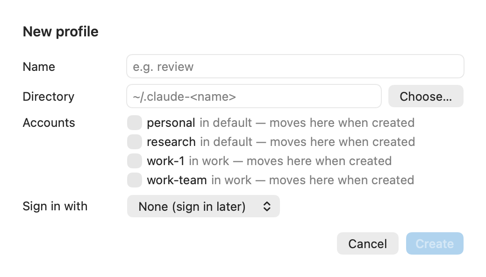

# Settings → Profiles

Create, edit and remove Claude Code profiles: their pools, their own thresholds and their Chrome profile.

See also: [cs profile](../cli/profiles.md) · [Concepts → profiles and pools](../concepts.md#profiles-and-pools) · [GUIDE → Multiple Claude Code profiles](../GUIDE.md#multiple-claude-code-profiles) · [PROFILES.md](../PROFILES.md)

**Settings...** in the popover opens this pane first. One card per profile.
A closed card shows the directory, pool and thresholds in one line, and
**Edit** opens it. The rings at the top left of an open card are the live
account's week and session; the dot and text at the right say whether the
profile is signed in, and as which account.

## An open profile

| control | what it does | CLI | default |
|---|---|---|---|
| **ACCOUNTS** chips | one chip per account in the pool, with its small rings and binding figure, or its state (`refused`, `needs login`). A chip's menu: **Remove from default...** and **Move to work...** | `cs profile pool 
 remove <id> [--to <other>]` | |
| **+ Add** | adds an account to this pool: one in no pool, or one moved from another profile's pool after a confirmation that names the move | `cs profile pool 
 add <id>`, or `cs profile pool <other> remove <id> --to 
` | |
| **FOLDERS** | the folders that pick this profile: `cs run` with no name in one of them runs this profile, and `cs profile which` says so. Globs, comma-separated (`~/work/**, ~/clients/**`); empty clears them. Hidden with a CLI that does not report `paths` | `cs profile set 
 paths <glob,glob>` | none |
| **Switch at session** | this profile's `switch_at`. Empty inherits the global value, shown as "90% (global)"; ↺ goes back to inheriting | `cs profile set 
 switch_at <n>` | inherit (85) |
| **Switch at week** | this profile's `switch_at_weekly` | `cs profile set 
 switch_at_weekly <n>` | inherit (98) |
| **Hard floor** | this profile's `hard_floor` | `cs profile set 
 hard_floor <n>` | inherit (99) |
| **Landing margin** | this profile's `landing_margin` | `cs profile set 
 landing_margin <n>` | inherit (10) |
| **Count model limits** | this profile's `models` | `cs profile set 
 models <list>` | inherit (none) |
| **Spend first** | this profile's `prefer`: **Inherit**, **Most room** or **Expiring quota** (a menu) | `cs profile set 
 prefer room\|expiring` | inherit (Most room) |
| **Chrome profile** | the Chrome profile Claude in Chrome is used from for this profile's accounts that have none of their own. Lists your Chrome profiles by name | `cs profile set 
 chrome <name>`; `inherit` for the default | Chrome's last used |
| **Open Claude Code** | your terminal running Claude Code in this profile | `cs run 
` | |
| **Open Chrome** | opens the live account's Chrome profile | `cs chrome open <id>` | |
| **Shown in menu bar** | the menu bar follows this profile | | `default` |
| **Remove profile...** | removes the profile, after you choose which profile its accounts move to. The profile's directory is kept | `cs profile remove 
 --to <other>` | |
| **Sign in with** (only when **Not signed in**) | signs the profile in with one of its pool's stored credentials | `cs profile seed 
 <id>` | |

The threshold fields check what you type against the setting's range and show
the CLI's own message when it refuses. More on what each threshold does:
[Settings → Rotation](settings-rotation.md).

## New profile

| field | what it is | default |
|---|---|---|
| **Name** | the profile's name | |
| **Directory** | its Claude Code config directory; **Choose...** picks one | `~/.claude-<name>` |
| **Accounts** | the accounts that move into its pool. Each says which profile it leaves | none |
| **Sign in with** | the account the new profile starts signed in as | None (sign in later) |

**Create** runs `cs profile create <name> [--dir <dir>] --pool <ids>
[--seed <id>]`. What that does to the directory (links to your settings, a
copy of your MCP servers):
[GUIDE → Making a profile](../GUIDE.md#making-a-profile-and-starting-claude-code-in-one).

## Old profiles still holding a credential

A removed or repointed profile's last login stays guarded, so that account
is not swapped into another profile while it might still be live there. This
section lists them; **Forget...** releases one (`cs profile forget 
`).

[← Documentation index](../README.md)
