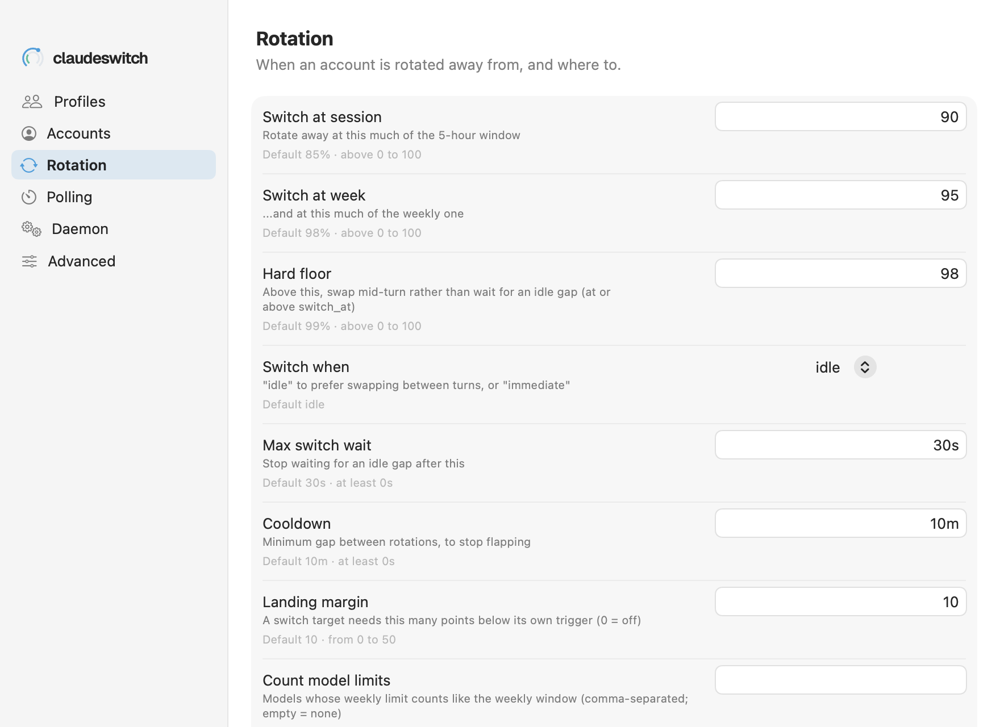

# Settings → Rotation

When an account is rotated away from, and where to: the global rotation settings.

See also: [cs config](../cli/config.md) · [Concepts → how rotation decides](../concepts.md#how-rotation-decides) · [GUIDE → Configuration](../GUIDE.md#configuration)

Every row is one `cs config` setting. The app builds the pane from
`cs config schema --json`, so the label, description, default and range below
each field are the CLI's own. Typing a value and leaving the field saves it
with `cs config set <key> <value>`; a value out of range is refused with the
CLI's message, and a saved one says "Saved: old → new" and whether the running
daemon picked it up. These are the global values: a profile can override the
ones marked "per profile" in [Settings → Profiles](settings-profiles.md).

| row | key | what it does | default | range |
|---|---|---|---|---|
| **Switch at session** | `switch_at` | rotate away at this much of the 5-hour window. Per profile | 85% | above 0 to 100 |
| **Switch at week** | `switch_at_weekly` | ...and at this much of the weekly one. Per profile | 98% | above 0 to 100 |
| **Hard floor** | `hard_floor` | above this, swap mid-turn rather than wait for an idle gap (at or above `switch_at`). Per profile | 99% | above 0 to 100 |
| **Switch when** | `switch_when` | `idle` prefers swapping between turns; `immediate` does not wait | idle | idle, immediate |
| **Spend first** | `prefer` | which eligible account rotation moves to: **Most room**, or **Expiring quota**, the account whose weekly window resets soonest while it still has unused quota (ties go to room). Per profile. Hidden with a CLI that predates it | Most room (`room`) | room, expiring |
| **Max switch wait** | `max_switch_wait` | stop waiting for an idle gap after this | 30s | at least 0s |
| **Cooldown** | `cooldown` | minimum gap between rotations, to stop flapping | 10m | at least 0s |
| **Landing margin** | `landing_margin` | a switch target needs this many points below its own trigger (0 = off). Per profile | 10 | 0 to 50 |
| **Count model limits** | `models` | models whose per-model weekly limit counts like the weekly window (comma-separated; empty = none). Per profile | none | |

The screenshot shows example values (90, 95, 98) that differ from the
defaults, which is why each row also prints its default. The reasoning behind
each default: [GUIDE → Configuration](../GUIDE.md#configuration).

[← Documentation index](../README.md)
