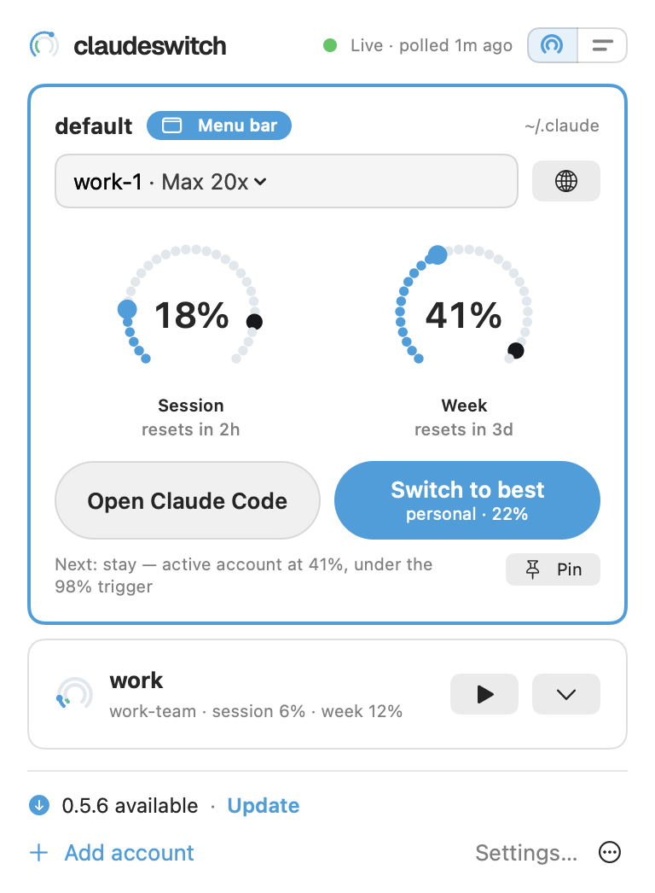

# Updates

The app checks once a day for a newer release, and updates the app and the
`claudeswitch` binary together.

See also: [Popover](popover.md) · [Settings → Advanced](settings-advanced.md) · [Settings → Daemon](settings-daemon.md)

## The check

Once a day the app makes one unauthenticated call to GitHub:
`GET https://api.github.com/repos/<owner>/claudeswitch/releases/latest`.
It compares the release's tag with the app's own version and ignores
drafts and pre-releases. A failed check is logged (subsystem
`xyz.claudeswitch.menubar`, category `flows`) and tried again the next day.

| control | where | what it does | default |
|---|---|---|---|
| **Check for updates** | Settings → Advanced → This app | off makes no call at all, and hides an offer already found | on |
| **Check now** | under it | checks at once, whatever the day | |
| **Check for updates** | the popover's ⋯ menu | the same | |

## Update

When the release is newer, the popover's foot shows **0.5.6 available ·
Update**. Update:

1. reads the latest release again;
2. downloads the app zip (`ClaudeSwitch-<version>-macos.zip`), its
   `.sha256`, this Mac's binary archive
   (`claudeswitch_<tag>_darwin_arm64.tar.gz` or `…_darwin_amd64.tar.gz`)
   and `checksums.txt`;
3. checks both downloads against their published SHA-256, before anything
   is changed;
4. unpacks them in a temporary folder (`tar`, `ditto`);
5. replaces the binary the app runs (the one in Settings → Advanced →
   claudeswitch, followed through links to the file itself) with
   `install -m 0755`;
6. moves the running app aside and puts the new bundle in its place;
7. restarts the daemon on the new binary (`claudeswitch daemon restart
   --json`; no daemon installed is fine);
8. relaunches the app.

**Any failure leaves both as they were** and says why in the popover: a
download that fails or does not match its checksum stops before anything is
touched; a binary or app that cannot be replaced (a folder you cannot
write, say) is put back; a daemon that will not restart on the new binary
puts both back and restarts it on the old one.

The new app is ad-hoc signed like the release zip. Downloaded by the app
itself, it is not quarantined, so it opens without the Gatekeeper prompt a
browser download meets.

[← Documentation index](../README.md)
