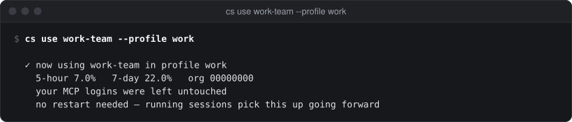

# cs use, login, add and the account commands

Adding, switching, renaming, ordering and removing accounts, and the recovery copies a swap keeps.

See also: [status](status.md) · [profiles](profiles.md) · [chrome](chrome.md) · [app: Settings → Accounts](../app/settings-accounts.md) · [app: Add account](../app/add-account.md) · [GUIDE → Adding an account](../GUIDE.md#adding-an-account) · [APP_CLI.md → account](../APP_CLI.md#account)

An account is one seat (one person in one organization) with a vaulted
credential and a name you choose, such as `personal` or `work-1`. A name is
the only thing you type; claudeswitch checks every credential against the
seat recorded for that name ([concepts](../concepts.md)).

Flags can come before or after the positional arguments, written `--name` or
`-name`. Every command here takes `--config PATH` (default
`~/.config/claudeswitch/config.toml`).

## Exit status

| status | when |
|---|---|
| `0` | success |
| `1` | the command failed or refused; the message is on stderr as `claudeswitch: <message>`. With `--json`, one error object on stdout instead: `{"error": {"code", "message", "hint"}}` ([error codes](../APP_CLI.md#error-codes)) |
| `2` | an unknown command, no command, or (for `use`, `login`, `add`, `accounts`, `refresh`, `rename`, `forget`, `identify` and `recovery` without `--json`) a flag the command does not know |

`account`, `priority` and `remove` report a bad flag as a `usage` error with
status 1.

Commands with `--json` never prompt: where a question would be needed they
fail instead (`confirmation_required`, `name_required`).

## cs use

```
cs use <id> [--profile NAME] [--dry-run] [--json]
```

Swaps a profile onto a vaulted account. Only the live credential's
`claudeAiOauth` part changes; MCP logins are carried over unchanged. Running
Claude Code sessions pick it up from their next request, with no restart.

| flag | default | meaning |
|---|---|---|
| `--profile NAME` | the profile this shell's `CLAUDE_CONFIG_DIR` belongs to | the profile to switch |
| `--dry-run` | off | say what would happen, change nothing |
| `--json` | off | machine-readable output |

<p align="center"></p>

It refuses, and changes nothing, when:

- the account is not in the profile's pool (`outside_pool`), or another
  profile's pool lists it (`in_other_pool`): a swap across pools is how one
  credential ends up live in two profiles, so there is no `--force`;
- the account is not vaulted (`not_vaulted`: "Log in to it, then run
  `claudeswitch add <id>`");
- the account is, or may be, live in another profile (`live`). If a rate
  limit is why it could not be confirmed, the message says when to retry.

After a swap it reads the new account's usage to confirm it, and prints the
Claude in Chrome line when you use Chrome profiles ([chrome](chrome.md)).

`--json` (fixture `cli-use.json`):

```json
{
  "account": "personal",
  "dry_run": false,
  "five_hour": 12.5,
  "from": "work-1",
  "org_id": "33333333-3333-3333-3333-333333333333",
  "profile": "default",
  "seven_day": 40,
  "verified": true
}
```

With `--dry-run --json` the object has `"dry_run": true` and nothing is
written.

## cs login

```
cs login <id> --direct [--browser APP] [--no-open] [--profile NAME] [--sso] [--email ADDR] [--prompt select_account|login] [--json]
cs login <id> --code <code> [--json]
cs login <id> [--profile NAME] [--keep] [--sso] [--browser APP]
```

Signs in to an account, verifies it is the seat that name stands for, vaults
the credential and, for a new name, writes it into the config pinned to the
seat that came back.

**`--direct`** (recommended) obtains the credential itself and never touches
any live session. It prints (or opens) the authorize URL and stops:

```
  Then finish with:

    claudeswitch login research --code <the-code>

  Your live session is not affected by any of this, whatever happens.
  The attempt expires at HH:MM (in 6h0m0s).
```

Approve the page in the browser, copy the code it shows, and run the
`--code` command it printed. The pending attempt lasts six hours.

**Without `--direct`**, `login` signs in through Claude Code in a profile
whose pool holds the account, then puts that profile's previous account
back (unless `--keep`). It is refused when the account may be live in
another profile; the message suggests `--direct`.

| flag | default | meaning |
|---|---|---|
| `--direct` | off | obtain the credential without touching the live session |
| `--code CODE` | none | finish a `--direct` login started earlier, with the code from the callback page |
| `--browser APP` | your default browser | open the authorize URL in this browser application, such as `Safari` or `"Brave Browser"`. A browser you do not normally use has its own cookies, which is how you get a different account |
| `--no-open` | off | with `--direct`: print the URL, open nothing |
| `--profile NAME` | this shell's profile | without `--direct`, the profile to sign in through; with `--direct`, the profile whose pool a new account joins |
| `--keep` | off | without `--direct`: stay on the newly signed-in account instead of switching back |
| `--sso` | off | use the SSO login flow |
| `--email ADDR` | none | sent as `login_hint`: the address of the account you want |
| `--prompt VALUE` | none | the authorize `prompt` parameter: `select_account` forces the account chooser, `login` forces re-authentication |
| `--pin-org` | off | send `organization_uuid` in the authorize URL. The endpoint accepts and ignores it; for experiment only |
| `--json` | off | machine-readable output, with `--direct` or `--code` only; never prompts |

A login returns whichever account the browser is signed in to; nothing in the
request can choose it. What comes back is checked: a seat that does not match
the name's recorded seat is refused (`wrong_account`), and so is a credential
already vaulted under another name (`already_vaulted`). Nothing is stored in
either case.

`--direct --json --no-open` returns `url`, `expires_at` and `pending`
(`account`, `new_account`, `org_id`, `profile`). `--code --json` returns the
vaulted account: `account`, `email`, `plan`, `seat`, `org_id`, `profile`,
`pool`, `configured`, `new_account`, `renewable`, `access_expires_at`,
`refresh_expires_at` ([APP_CLI.md → Adding an account](../APP_CLI.md#adding-an-account-owner-decision-m4)).
`--json` without `--direct` or `--code` is a `usage` error. `--code` with no
attempt pending, or an expired one, is `no_pending_login`.

The [Add account sheet](../app/add-account.md) runs
`login <id> --direct --json --no-open` and then `login <id> --code <code> --json`.

## cs add

```
cs add [<id>] [--profile NAME] [--from PROFILE] [--force] [--json]
```

Vaults the credential that is live right now, typically after `/login` in
Claude Code, under `<id>`, and adds the account to the config pinned to its
seat, last in `priority`. Running it again for the same account refreshes the
stored credential in place.

| flag | default | meaning |
|---|---|---|
| `<id>` | asks, suggesting a name from the account | the name to file it under |
| `--profile NAME` | this shell's profile | the profile whose pool the account joins and, without `--from`, whose live credential is read |
| `--from PROFILE` | `--profile` | the profile whose live credential to vault, when it is not `--profile` (the app's "Save current login") |
| `--force` | off | re-add even when the live credential looks staler than the one already vaulted under that name |
| `--json` | off | machine-readable output; never prompts |

With no `<id>` and nobody to ask (piped, or `--json`), it fails with
`name_required`, and the error's `hint` is the suggested name. The same seat
already vaulted under another name is refused (`already_vaulted`). A running
daemon notices the config change and starts polling the new account without
a restart.

## cs refresh

```
cs refresh <id> [--allow-active]
```

Renews a vaulted account's credential now. The daemon does this by itself
before credentials expire
([→ Keeping credentials alive](../GUIDE.md#keeping-credentials-alive)), so
you rarely need it.

| flag | default | meaning |
|---|---|---|
| `--allow-active` | off | permit refreshing an account that is live in a profile |

Refreshing revokes the previous token. For an account live in a profile,
that is the token the running Claude Code session holds, so without
`--allow-active` it explains this and does nothing (status 0). With it, the
new token is written to both the vault and the live item. Every profile's
live item is checked, so no `--profile` can narrow it.

Exit status: 1 when the account is not vaulted or the refresh fails.

## cs accounts

```
cs accounts [--json]
```

What is in the vault: one row per configured account in rotation order, with
`▸` for an account live in a profile, the address it is signed in as, its
plan and its organization. An account with no stored credential reads
`not vaulted`.

`--json` returns an array; each element has `id`, `vaulted`, `active`, the
profile keys, and `seat`, `org_id`, `email` and `plan` when known.

## cs account

```
cs account list [--json]
cs account rename <old> <new> [--json]
cs account delete <id> [--yes] [--json]        (also: account remove)
cs account pin <id> [--hard] [--json]
cs account unpin [<id>] [--profile NAME] [--json]
cs account priority <id>... [--json]
```

The account commands the app runs. Each takes `--json` and `--config`.

### cs account list

Every account, with its profile, the profile it is live in, whether it is
pinned (and whether hard, `pin_hard`), its state (`available`, `needs_login`, `refused`, ...), plan, email,
seat, login expiry and its last reading (`five_hour`, `seven_day`,
`binding`, `refused_until`, `error`). This is what Settings → Accounts
shows. Shape: [APP_CLI.md → account](../APP_CLI.md#account).

`refresh_expires_at` (in `--json`) is when the account's refresh token
expires, as state.json last recorded it — never read from the keychain, so
the app's re-login reminders (IMPROVEMENTS F5) can poll it. The daemon
records it whenever it polls the account, live or vaulted, and the CLI when
it vaults one; it is `null` when unknown (never recorded, or a credential
that does not report it, such as one from `login --direct`).

### cs account rename

The same as [`cs rename`](#cs-rename), with `--json`:
`{"account": "<new>", "previous": "<old>"}`.

### cs account delete

The same as [`cs remove`](#cs-remove).

### cs account pin, unpin

`pin <id>` stops automatic rotation in the profile `<id>` is live in. Only the
live account can be pinned (`not_active` otherwise); a pin on another would
hold the profile on whatever it is using now. The popover's **Pin** runs it.

**The pin safety valve.** If the pinned account is refused (a 429 in the
transcripts), is out of quota (a current reading at 100% on either window)
or needs a sign-in (its refresh token has expired, or its last read failed
with an error only a sign-in cures), the daemon lifts the pin and rotates as
usual. It says why in its log, in a notification and in the audit log
(`kind: unpin`): `pin on work-1 lifted: it was refused`. `cs why` shows the
same before the daemon acts. A dry-run daemon lifts nothing and records
what it would have done once (`[dry-run]`). `--hard` keeps the pin even
then, as every pin did before; a plain `pin` replaces a hard one.

`unpin` turns automatic rotation back on: in the profile `--profile` names,
in every profile pinned to `<id>`, or, with neither, in every profile.

`--json` (fixtures `cli-account-pin.json`, `cli-account-unpin.json`):

```json
{
  "pin_hard": false,
  "pinned": "work-1",
  "profile": "default"
}
```

```json
{
  "unpinned": [
    "default"
  ]
}
```

### cs account priority

The same as [`cs priority`](#cs-priority).

## cs priority

```
cs priority <id>... [--json]
```

Sets the rotation order: the accounts named, in that order. Accounts left out
follow in config order. Rotation tries a profile's pool in this order.
Settings → Accounts runs it when you drag a row.

`--json` returns `priority` (the list as written) and `order` (the full order
it gives). With no ids it is a `usage` error.

## cs rename

```
cs rename <old> <new>
```

Gives an account a new name everywhere: its `[[account]]` block, `priority`,
every pool, the vault item and the recorded state. The credential is copied
to the new name and read back before anything else changes, so it is never
lost. It also repairs a name written before the current naming rule.

Stop the daemon first: a running daemon refuses the rename
(`daemon_running`, hint `stop it first: claudeswitch daemon stop`).

## cs remove

```
cs remove <id> [--yes] [--json]
```

Deletes an account everywhere: its vaulted credential, its `[[account]]`
block, its pool and priority entries, and its recorded readings. It asks
first, naming the account and seat.

| flag | default | meaning |
|---|---|---|
| `--yes` | off | do not ask |
| `--json` | off | machine-readable output; never prompts |

It is refused while the account is, or may be, live in any profile (`live`;
the hint names the `use` command that frees it), and with `--json` or no
terminal and no `--yes` (`confirmation_required`). With a daemon running it
waits for the daemon to load the edited config before deleting the
credential (`daemon_not_loaded` if it does not).

`--json` returns `account`, `email`, `seat`, `org_id`, `daemon_running`,
`twin`, and `removed` with what went: `config`, `credential`, `pool`,
`priority`, `state`.

## cs forget

```
cs forget <id>...
cs forget --stale
```

Drops an account's recorded readings from the state file. The vault entry
and the config are untouched; the next poll reads it afresh.

| flag | default | meaning |
|---|---|---|
| `--stale` | off | drop every recorded account that is no longer in the config |

It prints `forgot [<ids>]`, or `nothing to forget`.

## cs identify

```
cs identify [<id>...] [--force]
```

Records which seat, email and plan each vaulted credential belongs to: one
identity lookup per account that is missing any of them. With no ids it does
every vaulted account. Accounts vaulted before emails were recorded gain one
here, which is what the Claude in Chrome sign-in steps name.

| flag | default | meaning |
|---|---|---|
| `--force` | off | re-read every account even if already identified |

When the usage API call budget is spent, the accounts left over are listed as
"not done yet", with a note to run `claudeswitch identify` again in a few
minutes.

## cs recovery

```
cs recovery [list] [--identify] [--json]
cs recovery restore <slot> <account> [--force] [--json]
cs recovery clear <slot> [--yes] [--json]
```

A swap saves the live credential it overwrites to its account's vault entry.
When it cannot tell whose the credential is, it keeps it in a recovery slot
(`r1`, `r2`, ...) instead, because it may be the only copy of a working login
([→ Recovery copies](../GUIDE.md#recovery-copies)).

| flag | default | meaning |
|---|---|---|
| `--identify` | off | list: ask whose each kept credential is (one identity lookup each, from the shared call budget) |
| `--force` | off | restore: replace the vaulted credential even when it looks better than the kept one |
| `--yes` | off | clear: do not ask |
| `--json` | off | machine-readable output; never prompts |

- `cs recovery` lists the slots: the profile each came from, when it was
  kept, the seat, whether it can be renewed, and the account it matches.
  With none it prints `no recovery copies kept`.
- `restore <slot> <account>` vaults the slot's credential as that account,
  checked against the account's seat, then clears the slot.
- `clear <slot>` deletes the slot after asking.

`cs recovery --json` (fixture `cli-recovery.json`, abridged):

```json
{
  "items": [
    {
      "account": "personal",
      "kept_at": "2026-10-07T08:00:00Z",
      "profile": "default",
      "renewable": true,
      "slot": "r1"
    },
    {
      "error": "unreadable item",
      "renewable": false,
      "slot": "r2"
    }
  ]
}
```

`restore --json` returns `account`, `slot`, `seat`, `renewable` and
`cleared`; `clear --json` returns `{"cleared": true, "slot": "r2"}`. Settings
→ Accounts lists the same slots with **Restore** and **Clear...**.

[← Documentation index](../README.md)
