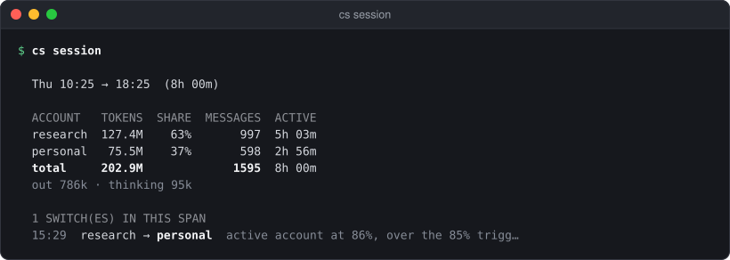

# cs and Claude Code

The commands Claude Code itself runs (the status line and the session-start context), the usage and history reports, and the plugin's `/cs` commands.

See also: [cs status](status.md) · [cs chrome](chrome.md) · [setup](setup.md) · [GUIDE → Inside Claude Code](../GUIDE.md#inside-claude-code) · [GUIDE → Sessions that span accounts](../GUIDE.md#sessions-that-span-accounts)

## Synopsis

```
cs statusline                  [--config PATH]
cs statusline install          [--force]
cs statusline uninstall
cs context                     [--config PATH]
cs session                     [--since DURATION] [--profile NAME] [--detail] [--json] [--config PATH]
cs history                     [--days N]
cs audit                       [-n N] [--kind KIND] [--since DURATION]
```

Flags may come before or after the arguments. An unknown flag prints the
command's flag list and exits 2.

## cs statusline

One compact line for Claude Code's status line:

```
personal  session ▓▓░░░░░░░░ 24% 3h48m  ▸week ▓▓▓▓░░░░░░ 44% 4d15h
```

It is strictly read-only: no polling, no API calls, no keychain, no state
writes, so it is safe to run on every render. It shows the profile of the
session it runs in (found from that session's `CLAUDE_CONFIG_DIR`), and with
several profiles it starts with the profile's name, as in `work: work-team`.

- `▸` marks the window that binds. An arrow (`↑` or `↓`) after its figure
  shows which way it moved since the reading before.
- Each figure is coloured by band: below 60%, from 60%, from the profile's
  `switch_at`, and from its `hard_floor`.
- A per-model weekly limit appears only when it binds or is at the weekly
  trigger.
- A refused account reads `personal  refused until 14:30  week ...`.
- After a switch is due the line says what happens next, and
  `· read 12m ago` means the readings have stopped moving.
- `⚠ daemon outdated` at the end means the running daemon is older than this
  binary: restart it.

Colour is on unless `NO_COLOR` is set (to anything) or
`CLAUDESWITCH_NO_COLOR` is non-empty.

| flag | default | meaning |
|---|---|---|
| `--config PATH` | `~/.config/claudeswitch/config.toml` | the config file |

It never fails a prompt: an unreadable config prints nothing, and other
problems print a short `claudeswitch  ...` note (`no account selected`,
`no reading yet`, `this session's CLAUDE_CONFIG_DIR is no configured profile`).
Exit status is 0 in all those cases.

The bands, trend arrows and every message in detail:
[GUIDE → Status line](../GUIDE.md#status-line).

### cs statusline install / uninstall

`install` writes `"statusLine": {"type": "command", "command": "claudeswitch statusline"}`
to Claude Code's `settings.json` (`~/.claude/settings.json`, or the one in
`CLAUDE_CONFIG_DIR` when that is set). It keeps the order of your keys and
leaves a copy of the previous file as `settings.json.claudeswitch.bak`.

```
$ cs statusline install
  ✓ status line set in ~/.claude/settings.json (takes effect on the next render)
```

| flag | default | meaning |
|---|---|---|
| `--force` | off | `install` only: replace a status line that is not claudeswitch's |

Without `--force`, someone else's status line is left alone and `install`
fails, exit 1, with `... already has a status line (...); leaving it`. A
status line that already runs `claudeswitch statusline` or `cs statusline`
is reported as `nothing to do`.

`uninstall` removes the status line only if it is claudeswitch's; otherwise it
says `status line is not claudeswitch's (...); leaving it` and exits 0.

`cs setup` and `/cs setup` offer the same install.

## cs context

The lines the plugin's SessionStart hook hands Claude at the start of every
session:

```
[claudeswitch] active personal · session 24% (resets 3h47m) · week 44% (resets 4d15h)
[claudeswitch] rotates at session 85% / week 98%, mid-turn at 99% · daemon running, rotates automatically
```

Like the status line it is read-only (no keychain, no API, no state writes)
and describes the session's own profile; with several profiles each line
starts `[claudeswitch] profile work · `. Two lines is the normal case. Extra
lines, all from the source:

| line | means |
|---|---|
| `· reading 12m old` (appended) | no reading newer than 10 minutes |
| `personal was refused until 14:30` | the live account hit a limit |
| `daemon NOT running, so nothing rotates automatically` | in place of `daemon running, ...` |
| `daemon in dry-run: it reports swaps but does not make them` | likewise |
| `next: <decision>. \`claudeswitch use <id>\` swaps now, no restart` | a switch is due |
| `next: <decision>` | every account is out; it says which recovers first |
| `the running daemon is older than this claudeswitch, ...` | restart the daemon |
| `no accounts set up yet; run \`claudeswitch setup\` in a terminal` | nothing configured |
| `config unreadable; run \`claudeswitch doctor\` in a terminal` | the config failed to load |

| flag | default | meaning |
|---|---|---|
| `--config PATH` | `~/.config/claudeswitch/config.toml` | the config file |

It always exits 0, so it can never fail a session start.
[GUIDE → Every session starts knowing where quota stands](../GUIDE.md#every-session-starts-knowing-where-quota-stands).

## cs session

Adds up token usage for a span of work across every account that served it.
Rotation splits one stretch of work over several accounts, and each account
only knows its own share, so this is the one place the total exists. It reads
Claude Code's transcripts, in every profile's directory.

```sh
cs session
```

<p align="center"></p>

The span, then one row per account (tokens, share of the total, messages,
active time), `(unattributed)` for usage it cannot place, the total, output
and thinking tokens, and the switches in the span with their reasons
(`no switches in this span` when there were none).

It covers every profile (decided 2026-10-08): each message counts against
the account live in its own profile when it was written, so an account's
row adds up its work in whichever profile used it, and the switch list
merges every profile's switches, each labelled with its profile when there
are several. `--profile NAME` reports one profile only.

| flag | default | meaning |
|---|---|---|
| `--since DURATION` | see below | how far back to look, e.g. `2h`, `24h` |
| `--profile NAME` | every profile | report only this profile's work and switches |
| `--detail` | off | per account: input, output and cache tokens, and messages per model |
| `--json` | off | machine-readable output |
| `--config PATH` | `~/.config/claudeswitch/config.toml` | the config file |

Without `--since` the span starts at today's first switch in any profile
reported, or 8 hours ago if that is earlier. So a day of work across
rotations reads as one session, and a quiet day is the last 8 hours.
"Today" is your local calendar day; `--profile` limits the switches it
looks at to that profile.

`--json`:

```
{"from": ..., "to": ..., "profiles": ["default", ...],
  "accounts": [{"account", "tokens", "messages", "active_seconds",
  "input", "output", "cache_read", "cache_write"}], "total_tokens": ..., "messages": ...,
  "switches": <count>,
  "switch_events": [{"at", "profile", "from", "to", "reason"}]}
```

A transcript problem is printed as `note: ...` on stderr and the report still
runs. Exit 0, or 1 if the config or state cannot be loaded.
[GUIDE → Sessions that span accounts](../GUIDE.md#sessions-that-span-accounts).

## cs history

Reads Claude Code's transcripts for limit refusals, de-duplicates them, and
lists the real ones, newest first:

```
  412 raw records over 21 days → 3 real limit hits after dedupe

  WHEN         WINDOW   CLEARED
  ...
```

Each row is the day, the window (`5-hour` or `weekly`) and the time it
cleared. With none: `no refusals recorded`. (The header line's wording is the
source's; its numbers here are illustrative.)

| flag | default | meaning |
|---|---|---|
| `--days N` | `21` | how far back to read |

Exit 0, or 1 if the transcripts cannot be read.

## cs audit

What the daemon observed, decided and did, newest first, from its audit log:

```
  WHEN         WHAT       DETAIL
  10-08 15:01  switch     research → personal  active account at 86%, over the 85% …
  10-08 15:01  decision   switch → personal  ...
```

Kinds and what their DETAIL shows:

| kind | shown as | detail |
|---|---|---|
| `switch` | switch | `from → to` and the reason |
| `rejection` | refused | the account, the window, when it cleared |
| `decision` | decision | stay, switch or wait, the target, the reason |
| `severity` | severity | an account's limit changing severity, with the percentage |
| `error` | error | the error |

`[dry-run]` marks what a dry-run daemon would have done; `[forced]` a swap
made mid-turn. With an empty log: `no audit events yet (run \`claudeswitch watch\`)`.

| flag | default | meaning |
|---|---|---|
| `-n N` | `30` | how many events |
| `--kind KIND` | all | only `decision`, `switch`, `rejection`, `severity` or `error` |
| `--since DURATION` | all | only events newer than this, e.g. `24h` |

`cs audit --kind decision` is how to check a dry-run daemon's judgement before
`cs daemon live` ([cs daemon](daemon.md)). Exit 0, or 1 if the log cannot be
read. The rows above show the layout; their values are illustrative.

## The plugin

The Claude Code plugin `cs@claudeswitch` (installing it:
[README → Claude Code plugin](../../README.md#claude-code-plugin)) adds two
hooks and the `/cs` command. It carries no logic of its own: each piece calls
the binary, found on `PATH` or at `~/.local/bin/claudeswitch`.

### Hooks

| hook | runs | what it does |
|---|---|---|
| `SessionStart` | `cs context` | the lines above. Without the binary it says `plugin installed but \`claudeswitch\` is not on PATH`; with one too old for `context`, `the installed binary is older than this plugin`. Always exits 0 |
| `PostToolUseFailure` on `mcp__claude-in-chrome__*` | `cs chrome hint` | when a browser tool failed because the extension is on another claude.ai account or not connected, tells Claude which account Claude Code is on and the command to run, once per rotation. Only lines starting `[claudeswitch]` reach Claude ([cs chrome](chrome.md#cs-chrome-hint-plugin-hook)) |

Both time out after 10 seconds.

### /cs

`/cs <command> [args]` works like `cs` in a terminal. With no command it is
`status`. An unknown command lists the commands. You can also just ask, and
Claude picks the matching skill.

| command | skill | what it runs | changes anything |
|---|---|---|---|
| `/cs status` | `cs:status` | `cs status` | no |
| `/cs why` | `cs:why` | `cs why` | no |
| `/cs session` | `cs:session` | `cs session` | no |
| `/cs doctor` | `cs:doctor` | `cs doctor` | no |
| `/cs switch <id>`, `/cs use <id>` | `cs:switch` | `cs why --json`, then `cs use <id>` | yes, without asking: a swap is hot and reversible |
| `/cs login <id>`, `/cs add <id>` | `cs:login` | `cs login <id> --direct` | yes, after confirming the account and browser |
| `/cs setup` | `cs:setup` | checks the binary, `cs statusline install`, `cs doctor` | `settings.json`; asks before replacing a status line |

The commands live under `/cs` because `/status`, `/login` and `/doctor` belong
to Claude Code. A switch made from `/cs switch` takes effect from Claude's
next request, in the current session too. First-time account setup stays in
a terminal (`cs setup`).
[GUIDE → Skills](../GUIDE.md#skills).

[← Documentation index](../README.md)
