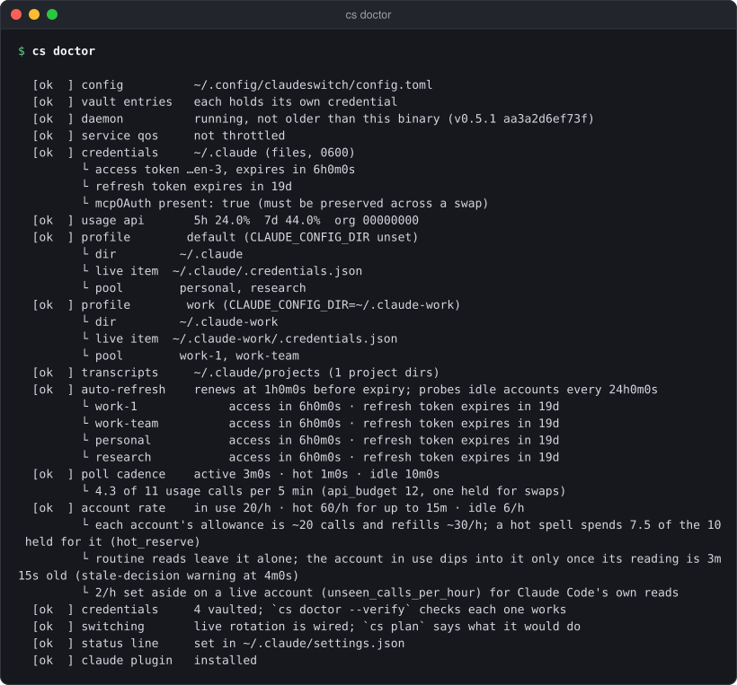
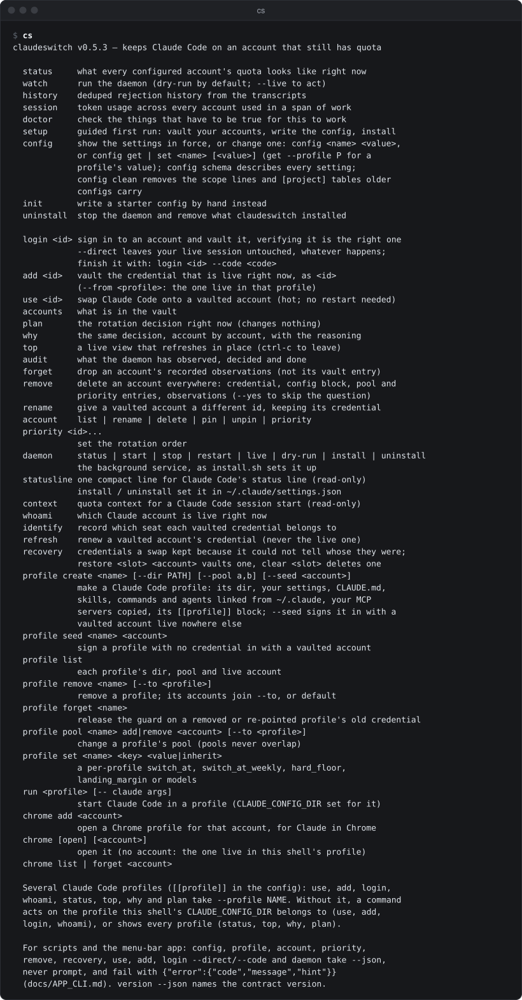

# cs setup, init, doctor, version

Getting started and checking the installation: the guided first run, a starter config by hand, the health check, and the version.

See also: [accounts](accounts.md) · [config](config.md) · [daemon](daemon.md) · [claude-code](claude-code.md) · [tutorial](../TUTORIAL.md) · [README → Quick start](../../README.md#quick-start)

## Exit status

| status | when |
|---|---|
| `0` | success |
| `1` | the command failed; the message is on stderr as `claudeswitch: <message>`. `version --json` and other `--json` commands answer a failure with one error object on stdout |
| `2` | an unknown command, no command, or a flag the command does not know |

## cs setup

```
cs setup [--config PATH]
```

The guided first run. It vaults each Claude account you want to rotate
between, writes the config, and offers to install the daemon and the status
line. Your current login is never disturbed: credentials are fetched
directly, not by signing you in and out.

| flag | default | meaning |
|---|---|---|
| `--config PATH` | `~/.config/claudeswitch/config.toml` | where to write the config |

It asks, in order:

1. For each account already vaulted, nothing: it lists them
   (`already vaulted: personal ...`).
2. **The account signed in now.** It names it (`Signed in now: <email> · ...`)
   and asks **Vault it** and **Name it**, suggesting a name.
3. **Add another account (N vaulted so far)**, repeated. For each: **Name
   it**, **Open in which browser** (blank prints the URL), then **Paste the
   code** from the sign-in page. The default answer is yes until two are
   vaulted.
4. **Order (ids, comma separated)**: the rotation order, written as
   `priority`.
5. **Hold "<last>" back as a reserve, never auto-spent past 70%**: sets
   `reserve = 70` on the last account in the order.
6. It writes the config (`✓ wrote <path>`).
7. **Install and start it now**: installs the daemon in dry run, exactly as
   `cs daemon install` does ([daemon](daemon.md)). It registers the binary
   you ran, so it works from a release binary and from a source checkout.
8. **Show quota in Claude Code's status line**, if it is not set yet: runs
   `cs statusline install`.
9. If the plugin is not installed, the two `/plugin` commands that install
   it.

It refuses to start:

- without a terminal: "setup asks questions, so it needs a terminal." Run it
  in a terminal, not with Claude Code's `!`;
- while the daemon is running, because the daemon owns the state file: stop
  it first.

Every account is written pinned to its seat. Accounts are added one at a
time later with [`cs login <id> --direct`](accounts.md#cs-login) or
[`cs add`](accounts.md#cs-add).

## cs init

```
cs init [--empty] [--json] [--config PATH]
```

Writes a commented starter config to edit by hand, instead of `setup`. It
never overwrites: if the file exists it fails with
`<path> already exists; not overwriting` (with `--json`, the error object
with code `exists`).

| flag | default | meaning |
|---|---|---|
| `--config PATH` | `~/.config/claudeswitch/config.toml` | where to write |
| `--empty` | off | write an empty config instead: comment lines only, no accounts and no settings, so every setting keeps its default. `cs add` and `cs login` then append the accounts |
| `--json` | off | answer `{"path": "<path written>"}` instead of the line below |

The file is written with mode 0600, its folder 0700. The macOS app's
first-run window runs `cs init --empty --json` before its first `add`.

The starter sets `switch_at = 85`, `switch_at_weekly = 98`,
`hard_floor = 99`, `switch_when = "idle"` and `cooldown = "10m"`, two example
`[[account]]` blocks and a `priority` line to replace with your own ids, and
commented-out `[[profile]]` blocks with the rules for `dir`. It prints
`wrote <path> — edit the account ids, then run `claudeswitch doctor``.
Accounts written this way have no seat until
[`cs identify`](accounts.md#cs-identify) records one; `setup`, `login` and
`add` record it for you.

## cs doctor

```
cs doctor [--verify] [--json] [--config PATH]
```

Checks everything that has to be true for claudeswitch to work, and says how
to fix what is not. Run it first when anything looks wrong.

| flag | default | meaning |
|---|---|---|
| `--verify` | off | also confirm every vaulted credential still authenticates (one API call each) |
| `--json` | off | every check as one object, with the fix the app can run (below) |
| `--config PATH` | the default config | the config to check |

<p align="center"></p>

Each line is `[ok  ]`, `[FAIL]`, or a warning or note, followed by details.
The checks, in the order shown:

| check | what it confirms |
|---|---|
| `config` | the config loads |
| `vault` | each entry holds its own credential (no two names share one) |
| `daemon` | the daemon is running and not older than this binary |
| `service qos` | macOS has not throttled the daemon's process |
| `credentials` | the live credential: where it is, when its access and refresh tokens expire, and that the MCP logins are present |
| `usage api` | the live account's usage can be read |
| `profile <name>` | each profile: its directory, its live credential item, its pool |
| `transcripts` | where Claude Code's transcripts are (for `session` and `history`) |
| `auto-refresh` | credential renewal is on, and each account's token expiry |
| `poll cadence` | the poll intervals and the calls they spend against the budget |
| `account rate` | each account's call rate in use, hot and idle |
| `credentials` (count) | how many accounts are vaulted |
| `switching` | live rotation is wired up |
| `status line` | it is set in Claude Code's `settings.json` |
| `claude plugin` | the plugin is installed |

Exit status: 1 when any line printed `[FAIL]` ("N doctor check(s) failed");
warnings and notes never fail it. Inside Claude Code, `/cs doctor` runs it.

### doctor --json

The same checks, for the app's Health pane (IMPROVEMENTS F12). The text is
unchanged; `--json` reads it back as one object per row:

```json
{"checks": [
  {"name": "daemon", "status": "fail", "level": "fail", "message": "older than this binary (0.5.6)",
   "details": ["the running daemon (0.5.5, started 2026-10-08 09:12) is older than this cs (0.5.6); restart it: …"],
   "fix": "daemon restart", "account": null, "profile": null},
  {"name": "refresh token", "status": "warn", "level": "warn",
   "message": "personal           access in 5h0m0s · refresh token expires in 3d",
   "details": [], "fix": "signin personal", "account": "personal", "profile": null},
  {"name": "status line", "status": "warn", "level": "info",
   "message": "not set; `cs statusline install` adds it", "details": [],
   "fix": "statusline install", "account": null, "profile": null}],
 "failed": 1}
```

- `name` is the row's name (`config`, `vault entries`, `daemon`,
  `credentials`, `usage api`, `profile`, `transcripts`, `auto-refresh`,
  `poll cadence`, `account rate`, `switching`, `status line`, `claude
  plugin`, …), `message` the rest of the row, `details` its `└` lines.
- `status` is `ok`, `warn` or `fail`. `level` is the row's own mark: `ok`,
  `warn`, `fail` or `info` (a note: its `status` is `warn`).
- `fix` is an action the app knows, or `null`: `signin <account>`,
  `daemon restart` (a daemon older than this binary), `statusline install`
  (the status line is not set), `keychain allow` (macOS: the live
  credential could not be read).
- Two kinds of check name an account (`account`), and are detail lines in
  the text: `refresh token`, one per vaulted account (`warn`, fix
  `signin <id>`, when its refresh token is missing, expired or expires
  within 5 days), and, with `--verify`, `credential`, one per account
  (`ok`; `fail` when it does not sign in or holds another seat; `warn` when
  it is not vaulted; fix `signin <id>` unless `ok`). A `profile` check names
  its `profile`.
- `failed` counts the `[FAIL]` rows, as the text's exit status does. With
  `--json` the exit status is 0 whenever the report was made: failures are in
  it, not in the exit (an exit of 1 is an error object, as for every `--json`
  command).

## cs version

```
cs version [--json]
cs -v
cs --version
```

Prints the build: `claudeswitch v0.6.3` for a release binary,
`claudeswitch dev` for a build from source (fixture `version.txt`). With no
command at all, `cs` prints the version line and every command with a
one-line description, and exits 2:

<p align="center"></p>

`--json` adds the app contract version, which the menu-bar app checks before
it runs anything:

an object with `version` (the same build string) and `contract` (`2` for
this release). See [APP_CLI.md → version](../APP_CLI.md#version).

Exit status: 0.

[← Documentation index](../README.md)
